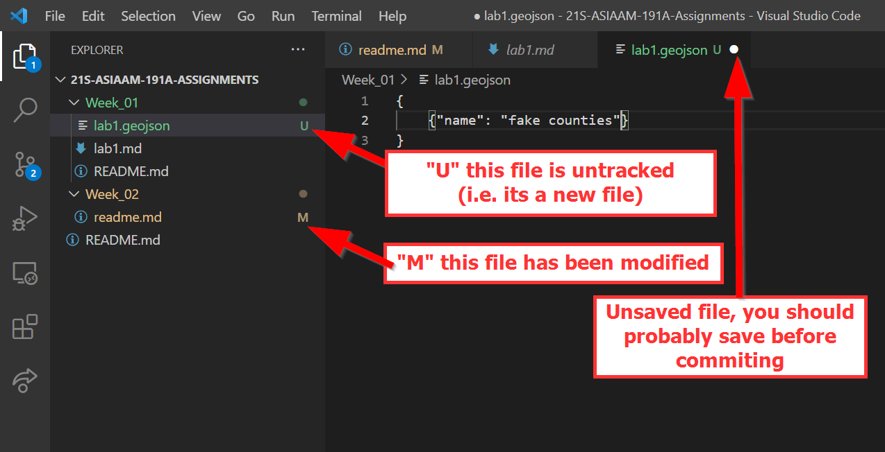
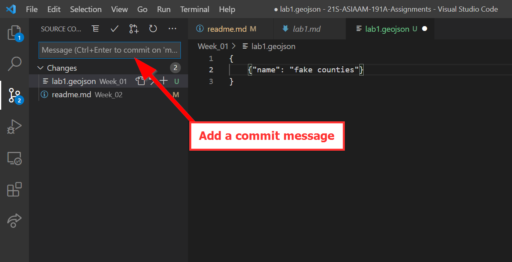
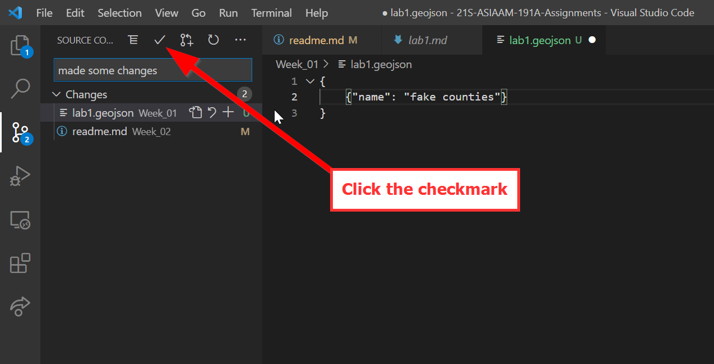
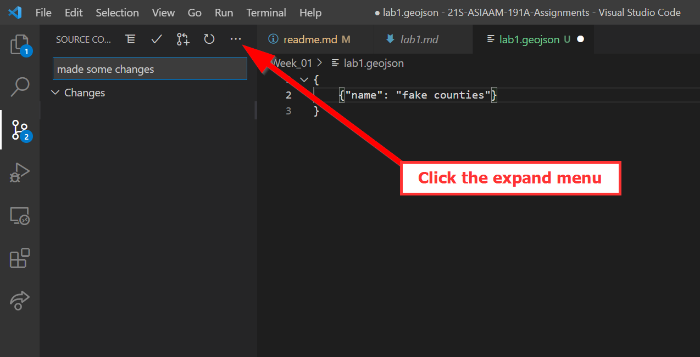
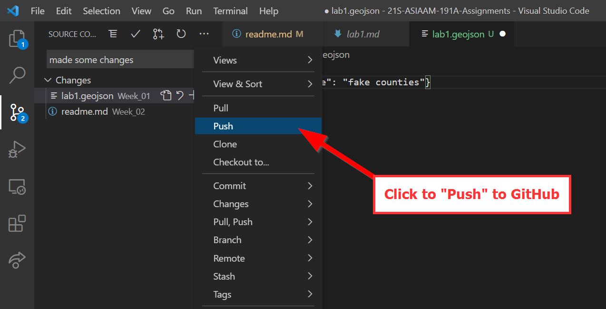
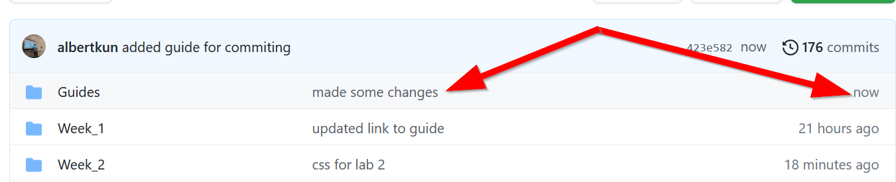

# Guide for using Git Commit in VS Code
### Requirements:
- [Git Clone completed](/help/git_cloning.md)

This guide will walk you through how to push to your lab assignment repo after you have finished your assignments.

1.  Make sure the explorer bar is active
   
2.  Make sure you have changes to commit, for example you should have modified a file (M), created a file (U), or deleted a file (D).

1.  Click on "Version Control" in the Activity Bar

1. Add a commit message that is meaningful

1. Click the checkmark

1. Click the expanded options menu

1. Choose "Push" to push to GitHub

1. Go to your GitHub repository and check to see if your repository has updated.

