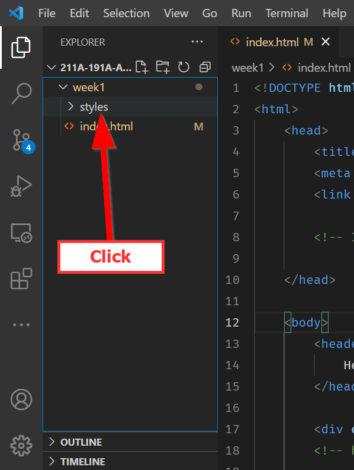
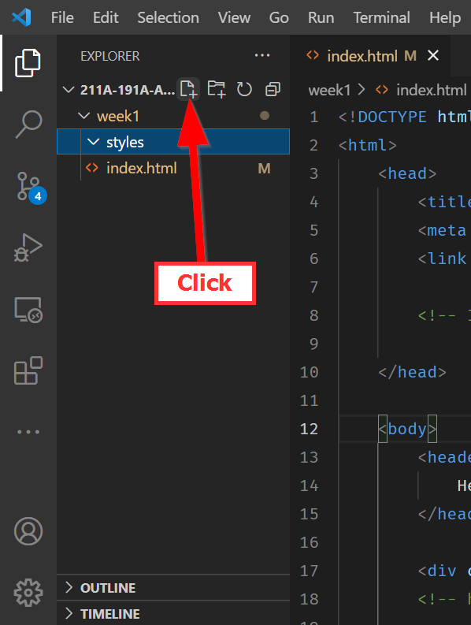
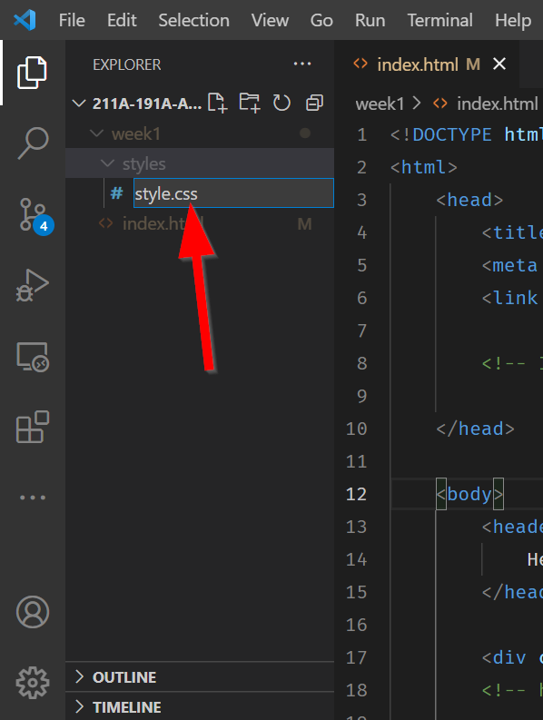

# Cool Stylin' Sheets

Let's add some Cascading Style Sheets (CSS) to customize our page better.

## Selectors: The ba-CSS-ics

Insert the following code in the `<head>` right before the closing tag (i.e. `</head>`):

``` html title="index.html"
<style>
    html { /* (1)! */
        background-color: aqua;/* (2)! */
    }
</style>
```

1.  `html` is the `CSS` selector, basically saying, "get anything in the `html` tags!
2.  `background-color` is the key, and then `aqua` is the color we are setting it to.

What happened to the page?

??? check "Answer"

    It became `aqua`!

### Special selectors

The `*` selector is a special selector that selects all elements on the page. This is useful for resetting all margins and paddings to ensure consistency across browsers. Add the following code to the `<style>` tag:

``` html title="index.html"
<style>
	* {
		font-family: Arial, sans-serif; /*(1)! */
	}
</style>
```

1.  `font-family` is the key, and then `Arial, sans-serif` is the font we are setting it to.

### Combining selectors

You can combine selectors to target specific elements. Add the following code to the `<style>` tag:

``` css title="index.html"
html, body {
	height: 100vh;
}
```

This code sets the height of the `html` and `body` elements to `100vh`, which is 100% of the viewport height. This ensures that the content fits the screen height.


## Adding linked CSS

CSSelecting content and changing them is cool, but what if you want to change the style of multiple pages? You would have to copy and paste the `<style>` tag into each page!

So this way of using CSS, called inline CSS (because it is in the HTML), can make your HTML file long and cumbersome. 

Standard practice is to have a separate file for CSS and bring that whole file in as a linked source.

Click the ==New Folder :material-folder-plus:== button:

{: style="max-width:300px"}

Type in ==styles== to name the folder `styles`:

{: style="max-width:300px"}

Highlight the `styles` folder by clicking on it:

{: style="max-width:300px"}

Then click on the ==New file :material-file-plus:== button:

{: style="max-width:300px"}

Name the file ==style.css==:

{: style="max-width:300px"}

Double click to open the new file. Then copy and paste the following CSS:

```css title="styles/style.css"
/* Resets all margins and paddings to ensure consistency across browsers */
* {
	font-family: Arial, sans-serif;
	margin: 0;
	padding: 0;
	box-sizing: border-box; /*(1)! */
}

/* Sets the overall background and ensures the content fits the screen height */
html{
	background-color: aqua; /*(3)! */
}

html, body {
	height: 80vh; /*(2)! */
	padding: 1rem; /*(4)! */
	box-sizing: border-box; /*(1)! */
}

/* Defines the page layout using a grid */
body {
	display: grid; /*(5)! */
	grid-template-areas: 
		"header"
		"main"
		"footer"; /*(6)! */
	grid-template-rows: auto 1fr auto; /* Adjusted to reflect the simplified structure */
}

main {
	display: grid; /*(14)! */
	grid-template-areas:
		"portfolio map"; /*(15)! */
	grid-template-columns: 1fr 1fr; /*(16)! */
}

/* Assigns each major section to a part of the grid */
header { 
	grid-area: header; /*(7)! */
}

main { 
	grid-area: main; /*(8)! */
}

.portfolio {
	grid-area: portfolio; /*(13)! */
}

#map { 
	grid-area: map; /*(9)! */
	height: 80vh; /*(10)! */
}

footer { 
	grid-area: footer; /*(11)! */
}
```

1. **Box-Sizing:** Makes sure **padding** and **border sizes** are included in the total **width** and **height** of elements, ensuring a consistent starting point across all browsers by resetting **margins**, **padding**, and **box-sizing**.
2. **Viewport Height (VH):** Calculates the **height** of the page to be **80%** of the **viewport height**.
3. **Background Color:** Colors the **background** of the page in **light blue**.
4. **Padding:** Adds **space around the content** inside `html` and `body`.
5. **Grid Display:** Turns the `body` into a **grid container** for layout.
6. **Grid Template Areas:** Defines the **layout areas** for the page sections.
7. **Header Area:** Places the **header** at the top of the page.
8. **Main Area:** Places the **main content** in the middle, now using a grid to organize internal sections.
9. **Map Area:** Designates an area for the **map**.
10. **Map Height:** Specifies how tall the **map** should be, taking up **80% of the viewport height**.
11. **Footer Area:** Places the **footer** at the bottom of the page.
12. **(Removed)**
13. **Portfolio Area:** Specifies the grid area for the **portfolio** section within the main area.
14. **Main Grid Display:** Introduces a grid within the `main` area to organize the **portfolio** and **map** sections.
15. **Main Grid Template Areas:** Defines the layout for the **portfolio** and **map** within the main area.
16. **Main Grid Columns:** Sets up two columns of equal width for the **portfolio** and **map** sections.

!!! important "Reminder!"
    Remember to save the `style.css` file (**PC:**++ctrl+s++ | **Mac:**++cmd+s++!

Next, go back to the ==index.html== file and replace your entire ==`<style> </style>`== content and tags with this code:

``` html title="index.html"
<link rel="stylesheet" href="styles/style.css">
```

This code tells the HTML file to use all of the CSS styles linked in the `href` attribute.

!!! note "More external CSS files?"
    You can have as many external references as you'd like, as long as you link them in this way. The bottom most CSS file has the most priority because it is the last CSS read and applied!

## ⚽ In-Class Exercise #2

!!! help "Task"
    1. Link `MapLibreGL`'s CSS that exists at this url: `https://unpkg.com/maplibre-gl/dist/maplibre-gl.css`
    
    Extra: If you finish early, try to see if you can load MapLibreGL's CSS locally instead!


We will go into CSS in more detail later, but what you need to know is that CSS has `HTML element selectors` which are then followed by the styles in `{ }`.

## 🏁Checkpoint

- Your `css` file should be in a folder called `styles` and named `style.css`.
- Your `index.html` file should have a link to the `style.css` file.
- Your `index.html` file should have a link to the `maplibre-gl.css` file.

Check to see if your code looks likes the following before moving on:

```html title="index.html" linenums="1" hl_lines="8 10-11"
<!DOCTYPE html>
<html>
    <head>
        <title>Hello World with MapLibreGl</title>
        <!-- hint: remember to change your page title! -->
        <meta charset="utf-8" />
        <link rel="shortcut icon" href="#">
        <link rel="stylesheet" href="styles/style.css">

        <!-- MapLibreGL's css-->
        <link rel="stylesheet" href="https://unpkg.com/maplibre-gl/dist/maplibre-gl.css" />
    </head>
    
    <body>
        <header>
			Hello World
            <!-- hint: you can make a menu with other links here if you'd like -->
        </header>
        
        <main>
			<div class="portfolio">
				<!-- Portfolio content goes here -->
				
			</div>
            <div id="map"></div>
        </main>
        <div id="footer">
            Copyright(2024)
        </div>
        <script src="js/init.js"></script>
    </body>
</html>
```


=== "With Comments"
	```css title="styles/style.css" linenums="1"
	/* Global reset to ensure consistency across browsers */
	* {
		font-family: Arial, sans-serif; /* Sets a default font for the whole page */
		margin: 0; /* Removes default margins */
		padding: 0; /* Removes default padding */
		box-sizing: border-box; /* Makes sure borders and paddings are included in the element's total width and height */
	}

	/* Sets the background color of the whole page and ensures content fits the screen height */
	html {
		background-color: aqua; /* Sets a light blue background color */
	}

	/* Applies to both <html> and <body> */
	html, body {
		height: 80vh; /* Sets the height to 80% of the viewport height, making sure the content fits on the screen */
		padding: 1rem; /* Adds a bit of space around the content for better readability */
		box-sizing: border-box; /* Ensures padding does not add to the set height */
	}

	/* Defines the main layout of the page using CSS Grid */
	body {
		display: grid; /* Enables CSS Grid layout */
		grid-template-areas: 
			"header" /* Top area for the header */
			"main"   /* Middle area for the main content */
			"footer"; /* Bottom area for the footer */
		grid-template-rows: auto 1fr auto; /* Sizes: auto for header and footer to fit content, 1fr for main to fill remaining space */
	}

	/* Sets up the layout for the main content area, dividing it into two columns */
	main {
		display: grid; /* Enables CSS Grid within the main element */
		grid-template-areas:
			"portfolio map"; /* Divides the main area into portfolio and map sections side by side */
		grid-template-columns: 1fr 1fr; /* Allocates equal width to both sections */
	}

	/* Grid area assignments for each major section, linking them to their respective areas in the grid */
	header { 
		grid-area: header; /* Assigns the header to its grid area */
	}

	main { 
		grid-area: main; /* Assigns the main content to its grid area */
	}

	.portfolio {
		grid-area: portfolio; /* Assigns the portfolio section to its grid area */
	}

	#map { 
		grid-area: map; /* Assigns the map section to its grid area */
		height: 80vh; /* Sets the map's height to 80% of the viewport height */
	}

	footer { 
		grid-area: footer; /* Assigns the footer to its grid area */
	}
	```

=== "Without Comments"
	```css title="styles/style.css" linenums="1"
	* {
		font-family: Arial, sans-serif;
		margin: 0;
		padding: 0;
		box-sizing: border-box;
	}

	html {
		background-color: aqua;
	}

	html, body {
		height: 80vh;
		padding: 1rem;
		box-sizing: border-box;
	}

	body {
		display: grid;
		grid-template-areas: 
			"header"
			"main"
			"footer";
		grid-template-rows: auto 1fr auto;
	}

	main {
		display: grid;
		grid-template-areas:
			"portfolio map";
		grid-template-columns: 1fr 1fr;
	}

	header { 
		grid-area: header;
	}

	main { 
		grid-area: main;
	}

	.portfolio {
		grid-area: portfolio;
	}

	#map { 
		grid-area: map;
		height: 80vh;
	}

	footer { 
		grid-area: footer;
	}
	```
