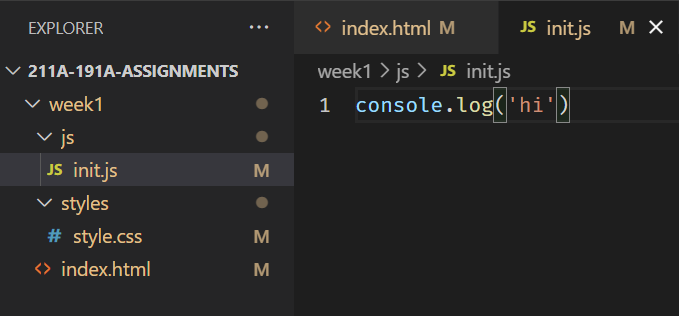

# Basics of JavaScript

Recall from the pre-lab [reading](https://developer.mozilla.org/en-US/docs/Learn/Getting_started_with_the_web/The_web_and_web_standards#html_css_and_javascript) that a webpage is like a house:

- HTML is the scaffolding/foundation of the house
- CSS is the paint, carpets, etc. that makes the house look nice
- JavaScript is the **appliances** that adds function to the house

### Why start with HTML and CSS first?

In order to do any JavaScript coding, you need to make sure your content has a place to show up! 

## What is JavaScript?

JavaScript is like the scriptwriter behind the scenes, turning static web pages into dynamic, interactive stories that captivate the audience. While there are various frameworks like React.js and Vue.js that offer additional features, this class will focus on the basics of JavaScript, also known as "vanilla" JavaScript, following the ES6+ standards. [Learn more about ES6+ standards here](https://www.tutorialspoint.com/es6/es6_quick_guide.htm).

In HTML, we use `<script>` tags to include JavaScript code. These tags can be placed in two main spots:

1. Inside the `<head>` section: JavaScript here loads before anything else on the page. This is a good spot for scripts that need to set things up before the page shows to the user.
2. Inside the `<body>` section or right before the closing `</body>` tag: This is where you typically put JavaScript that affects the content of the page. Since it loads after the HTML, it ensures all your page elements are loaded before the script tries to interact with them.

For our purposes, especially when working with libraries like `MapLibreGL.js`, it's important to load the library first. This means placing the `MapLibreGL.js` script in the `<head>` to ensure it's loaded and ready to go. Our custom JavaScript, which might interact with or initialize the map, should come later, ideally at the end of the `<body>` section. You can even place it in a `<footer>` tag to keep things organized and ensure it loads at the right time.

Remember, the order in which scripts are loaded can make or break your webpage- imagine putting the ending of a mystery movie at the beginning!

## It's a me Lego `Var`-io

Variables are like **boxes** that hold information, try to think of them as the building blocks of the instructions.

Variables are the Lego blocks of programming and can be **numbers**, **text**, or even collections of other variables! In programming languages we call variables can be classified into ==**types**==. In order to use a variable, you have to ==**declare**== variables. With JavaScript, variables are automatically assigned **types** based on their declaration. 

In JavaScript all declarations and lines should end with a semicolon `;`, which is like a `. (period)` in English that says, my statement is done.

These are examples of a ==declaration==:

```js
var day = 8;
var name = "Albert";
```

In front you see the `var` **keyword** that tells the web browser, "Hey this is a variable!". In this example, `day` is a **numeric** type with a value of `8` and `name` is a **string** type. Each type has certain properties and uses, for example you can add **numbers** together using something like `day + day`, but you adding strings will simply concatenate and not total them.

!!! info "What is a keyword?"
    In most coding languages, a **keyword** is a word that tells a program to treat the following text, numbers, or characters in a specific way. For example, `var myName` says treat `myName` as a variable.  This means you **CANNOT** name a variable `var`, Jar Jar Binks cousin Var Var Binks is **VARy** bad for JavaScript to see! i.e. `var var` Also note, you cannot use `spaces` in variable names!

## Some more variable definitions

What we really need to understand about variables is that they act like ==boxes== where you can **store** or **take** information out of.
- `const` acts like a locked safe that will not let you put anything into it after you define it
- `let` is like a regular box.
-  `var` is `VARy` problematic because it can be both locked and unlocked

Here are some of the types in JavaScript:

```js
//number
let box1 = 5;
let box2 = 5.0;

//string
let box3 = 'five';
let box4 = "five";

// string literal, uses backticks and ${variable} to bring in another variable
let box5 = `this is from box #4: ${box4}`;

// array
let box6 = [1,2,3,4,5]; 

// object, stores variables together, can be of different types!
let box7 = {"number": 'five', "value":5};

// boolean (true or false)
let box8 = true;

// null value
let emptyBox;
```

Remember, to declare a variable (give it a value) you must use the  ==`=`== symbol, like so:

```js
let my_variable = "exist!";
```

!!! notes "Anatomy of a variable declaration"
    - `let` is the keyword declaration of a variable
    - `my_variable` is the variable's name
    - `"exist!"` is the value for this variable
    - `;` defines the end of a line in JavaScript 

### LET's a go!

With JavaScript ES6, `let` and `const` keywords were introduced to declare variables. This change means that the recommend practice is to no longer use the `var` keyword. `let` and `const` variables get declared in the same way:

```js
let day = 8; //(1)!
const name = "Albert"; // (2)!
```

1. The `let` keyword **LETS** a variable CHANGE! :smile:
2. The `const` keyword declaration keeps a variable **CONST**ant!

## Let vs Const vs Var

!!! important "What is the difference?"

    1. The `let` keyword declaration ==LETS== a variable change
    2. The `const` keyword delcaration a variable **CONSTant** and will never change.
    3. The `var` allows varaibles to change or never change depending on **where** it was declared! VERY PROBLEMATIC!

Because `var` can be changing (mutable) and unchanging at the same time, so `var` was changed into off into two different variable types, `let` and `const`.

!!! important "Scopes: Local vs. Global"
    **Where** you `declare` a variable sets the scope to either a local one (limited to a function or area in the code) or global (can be accessed by anything/anywhere else in the code).

So, bye bye `var` and `LET` us welcome our new `CONST` variables to the JavaScript programming world.

!!! warning "TLDR"
    **DO NOT USE** `var` unless you need to code for Internet Explorer.

### Console.log()
By itself, our script tag does nothing. So, one VERY helpful JavaScript tool (method) that we should familarize ourself with is `console.log()`, because it allows us to test our code.

Add the following script:
```html
<script>
    console.log('Hello Asian Am 191! :)');
</script>
```

#### Nothing happened?! What!?
Actually, you are about to unlock your full web developer potential! 

In Firefox, right click anywhere on the page and the click `Inspect Element`:

This opens the `Developer Toolbar`!! You can find it by going to the Menu and going to `Web Developer` and then `Web Developer Tools`.

Click on the Console button:


Yay! Our message is there!


### Linking to another JavaScript file
Similar to the CSS files, we can move the JavaScript file into its own folder to avoid cluttering the HTML file. Importing libraries is the main way we level up our webpage.

BUT!!! Instead of `<link>` we use the `<script>` tag:

```html
 <script src="YOUR_SCRIPT_NAME.js"></script> 
```

The `src` attribute is location of your file.

### In-class Exercise #2
>#### Task:
>- Create a new folder called `js`
>- Add our script in there
>- Get our message to show up in the console 


<details>
<summary><b>Answer</b></summary>

1. Click on the `New Folder` button:


2. Type in `js`:


3. Click on the `New File` button:


4. Give it a name, like `init.js`



5. Within `index.html` before the end of the `<body>` element include the following:

```js
    //
    // ... HTML Truncated for brevity ...
    // 
    <script src="./js/init.js"></script>
</body>
```

</details>

### Hint
Never include `<script></script>` tags inside of a Javascript file, those are `HTML elements`!!!

## Hello MapLibreGL... Finally..
OK, why did we do ALL of that? Well, when we use MapLibreGL, we actually need to bring in MapLibreGL's JavaScript files!

So, in our header, let's add the following:

```html
<!-- MapLibreGL's JavaScript-->
<script src="https://unpkg.com/maplibre-gl/dist/maplibre-gl.js"></script>
```

Now, let's go ahead and add a container for our map. 

Notice in `<div id="main"></div>` that there is a `map` div after our portfolio section: 

```html
<div id="map"></div>
```

That is the container for the map! 

Open up the JavaScript file again and add the following MapLibreGL code template:

```javascript

// Initialize the map
const map = new maplibregl.Map({
    container: 'map', // container ID
    style: 'https://api.maptiler.com/maps/streets/style.json?key=wsyYBQjqRwKnNsZrtci1', // Your style URL
    center: [ -118.444, 34.0709], // Starting position [lng, lat]
    zoom: 15 // Starting zoom level
});

// Add a marker to the map
new maplibregl.Marker()
    .setLngLat([ -118.444, 34.0709])
    .setPopup(new maplibregl.Popup({ offset: 25 }) // Add popups
        .setHTML('Math Sciences 4328 aka the Technology Sandbox<br> is the lab where I used to work in '))
    .addTo(map);
```

#### Class Exercise #3 - Adding more markers
- Looking at the code above a little bit, we can see some latitude/longitude pairs. Copy the marker code add more markers of your choosing. **Note**: Be sure give the marker variable a new name, like `marker2`.  
- To find latitude/longitude of coordinates, please use this website:
   - [https://www.latlong.net/](https://www.latlong.net/)


## 🏁Checkpoint

- Your `index.html` should have a `<div>` with an ID of `map`
- Your `init.js` should have the MapLibreGL code template
- Your `init.js` should be linked in your `index.html` file


### Check your work

Check to see if your code looks likes the following before moving on:

```html title="index.html" linenums="1" hl_lines="13-14 28"
<!DOCTYPE html>
<html>
    <head>
        <title>Hello World with MapLibreGl</title>
        <!-- hint: remember to change your page title! -->
        <meta charset="utf-8" />
        <link rel="shortcut icon" href="#">
        <link rel="stylesheet" href="styles/style.css">

        <!-- MapLibreGL's css-->
        <link rel="stylesheet" href="https://unpkg.com/maplibre-gl/dist/maplibre-gl.css" />

		<!-- MapLibreGL's JavaScript-->
		<script src="https://unpkg.com/maplibre-gl/dist/maplibre-gl.js"></script>
    </head>
    
    <body>
        <header>
			Hello World
            <!-- hint: you can make a menu with other links here if you'd like -->
        </header>
        
        <main>
			<div class="portfolio">
				<!-- Portfolio content goes here -->
				
			</div>
            <div id="map"></div>
        </main>
        <div id="footer">
            Copyright(2024)
        </div>
        <script src="js/init.js"></script>
    </body>
</html>
```

```javascript title="js/init.js"
// Initialize the map
const map = new maplibregl.Map({
    container: 'map', // container ID
    style: 'https://api.maptiler.com/maps/streets/style.json?key=wsyYBQjqRwKnNsZrtci1', // Your style URL
    center: [ -118.444, 34.0709], // Starting position [lng, lat]
    zoom: 15 // Starting zoom level
});

// Add a marker to the map
new maplibregl.Marker()
    .setLngLat([ -118.444, 34.0709])
    .setPopup(new maplibregl.Popup({ offset: 25 }) // Add popups
        .setHTML('Math Sciences 4328 aka the Technology Sandbox<br> is the lab where I used to work in '))
    .addTo(map);
```


=== "With Comments"
	```css title="styles/style.css" linenums="1"
	/* Global reset to ensure consistency across browsers */
	* {
		font-family: Arial, sans-serif; /* Sets a default font for the whole page */
		margin: 0; /* Removes default margins */
		padding: 0; /* Removes default padding */
		box-sizing: border-box; /* Makes sure borders and paddings are included in the element's total width and height */
	}

	/* Sets the background color of the whole page and ensures content fits the screen height */
	html {
		background-color: aqua; /* Sets a light blue background color */
	}

	/* Applies to both <html> and <body> */
	html, body {
		height: 80vh; /* Sets the height to 80% of the viewport height, making sure the content fits on the screen */
		padding: 1rem; /* Adds a bit of space around the content for better readability */
		box-sizing: border-box; /* Ensures padding does not add to the set height */
	}

	/* Defines the main layout of the page using CSS Grid */
	body {
		display: grid; /* Enables CSS Grid layout */
		grid-template-areas: 
			"header" /* Top area for the header */
			"main"   /* Middle area for the main content */
			"footer"; /* Bottom area for the footer */
		grid-template-rows: auto 1fr auto; /* Sizes: auto for header and footer to fit content, 1fr for main to fill remaining space */
	}

	/* Sets up the layout for the main content area, dividing it into two columns */
	main {
		display: grid; /* Enables CSS Grid within the main element */
		grid-template-areas:
			"portfolio map"; /* Divides the main area into portfolio and map sections side by side */
		grid-template-columns: 1fr 1fr; /* Allocates equal width to both sections */
	}

	/* Grid area assignments for each major section, linking them to their respective areas in the grid */
	header { 
		grid-area: header; /* Assigns the header to its grid area */
	}

	main { 
		grid-area: main; /* Assigns the main content to its grid area */
	}

	.portfolio {
		grid-area: portfolio; /* Assigns the portfolio section to its grid area */
	}

	#map { 
		grid-area: map; /* Assigns the map section to its grid area */
		height: 80vh; /* Sets the map's height to 80% of the viewport height */
	}

	footer { 
		grid-area: footer; /* Assigns the footer to its grid area */
	}
	```

=== "Without Comments"
	```css title="styles/style.css" linenums="1"
	* {
		font-family: Arial, sans-serif;
		margin: 0;
		padding: 0;
		box-sizing: border-box;
	}

	html {
		background-color: aqua;
	}

	html, body {
		height: 80vh;
		padding: 1rem;
		box-sizing: border-box;
	}

	body {
		display: grid;
		grid-template-areas: 
			"header"
			"main"
			"footer";
		grid-template-rows: auto 1fr auto;
	}

	main {
		display: grid;
		grid-template-areas:
			"portfolio map";
		grid-template-columns: 1fr 1fr;
	}

	header { 
		grid-area: header;
	}

	main { 
		grid-area: main;
	}

	.portfolio {
		grid-area: portfolio;
	}

	#map { 
		grid-area: map;
		height: 80vh;
	}

	footer { 
		grid-area: footer;
	}
	```