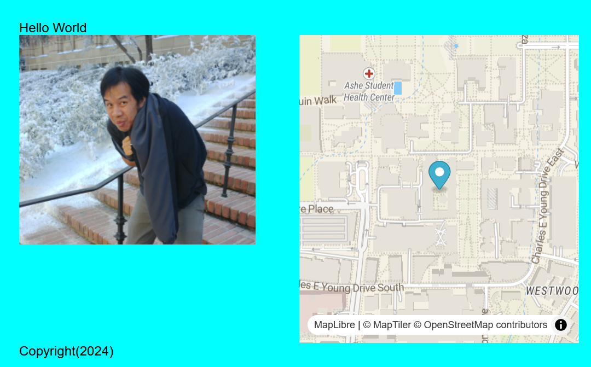

---
hide:
  - tags
tags:
  - Lab 1
---
# GITting down with labs and code

{: style="max-width:300px"}

## Objectives

!!! tldr "Goals"
    - Create a basic webpage
    - Add a map with markers
    - Publish your page onto GitHub pages

!!! warning "Reminder"
	The [pre-lab](../../assignments/week1/prelab) must be completed before attempting this lab.

### Lab outline

1. [Using VS Code](./0.md)
2. [Writing HTML](./1.md)
3. [Writing CSS](./2.md)
4. [Adding a Map](./3.md)
5. [Publishing with GitHub Pages](./4.md)
6. [Final Lab Code](./5.md)
   

This lab will walk you through the process of creating a static web page in HTML with some additional style elements using CSS. Then you will be tasked to host it using GitHub pages.
 
>Note: I highly recommend checking out the [MapLibreGL documentation](https://maplibre.org/maplibre-gl-js/docs/). Looking at any documentation before choosing any software is important, because badly documented libraries can make tools difficult to use. 
