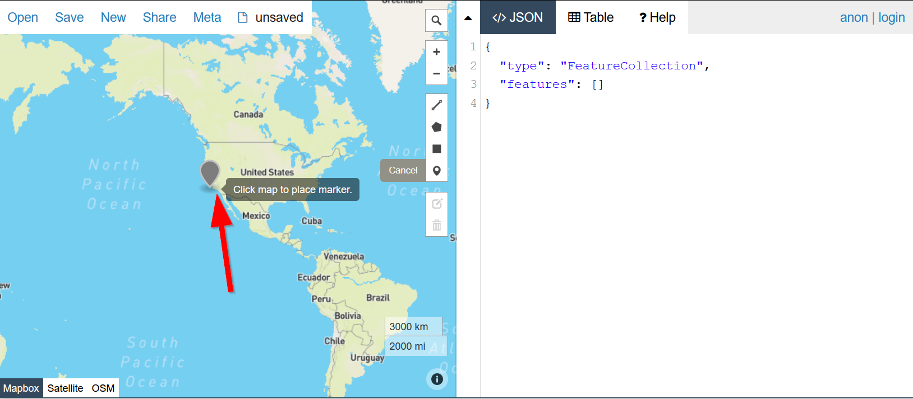
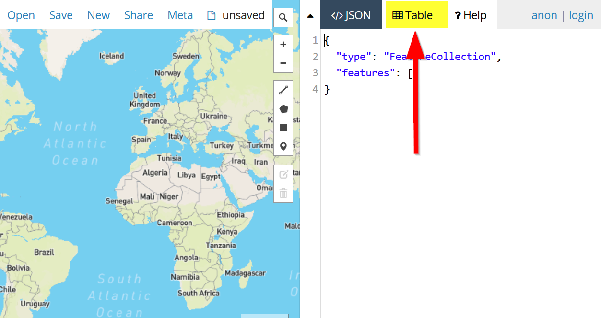
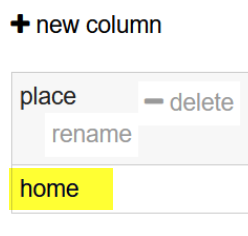

# Extra: Creating a GeoJSON file

Our class projects will connect information from our surveys to our map will, so first we will practice by creating a GeoJSON file of our own!

## The power of people-based web mapping

Let's put to practice what web development and GIS can do for empowering our own stories.

Head over to [GeoJSON.io](http://www.geojson.io/):

- [http://www.geojson.io/](http://www.geojson.io/)

Click on the ==marker :material-map-marker:== tool:


Click on a location of interest to you:



Switch to the Table view by clicking on ==:material-table: Table==:



Add a data column by clicking on ==:heavy_plus_sign: new column== :


Call it ==place== and click `OK`:


Click inside the ==`place`== column


Type in a description for the `place`, in this case I called it ==home==.

{: style="max-width:150px"}

Zoom out by pressing the ==:heavy_minus_sign:== button or ++ minus ++ key:


Click the ==edit :material-square-edit-outline:== button:


Click on the marker and move it the adjust the location:


Click the  edit :material-square-edit-outline: button and then ==Save== to save your edits:


Add a new column called ==color==, to put some color to your map later.


When you are done, save your file by going to the top menu's ==Save== option:


Click ==GeoJSON==:


Download the file to your computer:

{: style="max-width:300px"}

Copy the file into your project folder:


### ⚽In-class Exercise #1 - Leaving  your mark(er) on the map!

Go back and add more points to your GeoJSON file.

!!! tldr "Tasks"
    1. Add some points into your GeoJSON file
    2. Save the file and add it to your lab3 folder

After finishing the exercise, think about how empowering it was for you to be able to add data to the map yourselves. Whether you were clicking random spots or trying to find your old favorite places to visit, the ability to mark things is a reclaiming of mapping for yourself. This sense of staking a claim is what is meant when we refer to "empowering community voices".

## 🏁Checkpoint - Add your GeoJSON to your map

1. Make sure your GeoJSON file is in your `week2` folder!

2. Take note of the filename!

3. Modify your `js/init.js` file to add the GeoJSON file to your map:

```js title="js/init.js" linenums="1"
// Initialize the map
const map = new maplibregl.Map({
    container: 'map', // container ID
    style: 'https://api.maptiler.com/maps/streets-v2-light/style.json?key=wsyYBQjqRwKnNsZrtci1', // Your style URL
    center: [-118.4430,34.0691], // Starting position [lng, lat]
    zoom: 15 // Starting zoom level
});

function addMarker(lat,lng,title,message){
	let popup_message = `<h2>${title}</h2> <h3>${message}</h3>`
	new maplibregl.Marker()
		.setLngLat([lng, lat])
		.setPopup(new maplibregl.Popup().setHTML(popup_message))
		.addTo(map)

	return message
}

addMarker(34.070,-118.444, "UCLA", "Where I work on campus")
addMarker(34.056,-118.234, "Metro", "Where I work at Metro")
addMarker(34.056,-118.234, "Games", "Where I work at games")

fetch('map.geojson').then(
	response => response.json()
).then(
	data => {
		map.addSource('places', {
			'type': 'geojson',
			'data': data
		});
		map.addLayer({
			'id': 'places',
			'type': 'circle',
			'source': 'places',
			'paint': {
				'circle-color': '#4264fb',
				'circle-radius': 6,
				'circle-stroke-width': 2,
				'circle-stroke-color': '#ffffff'
			}
		});
	}
);
```
