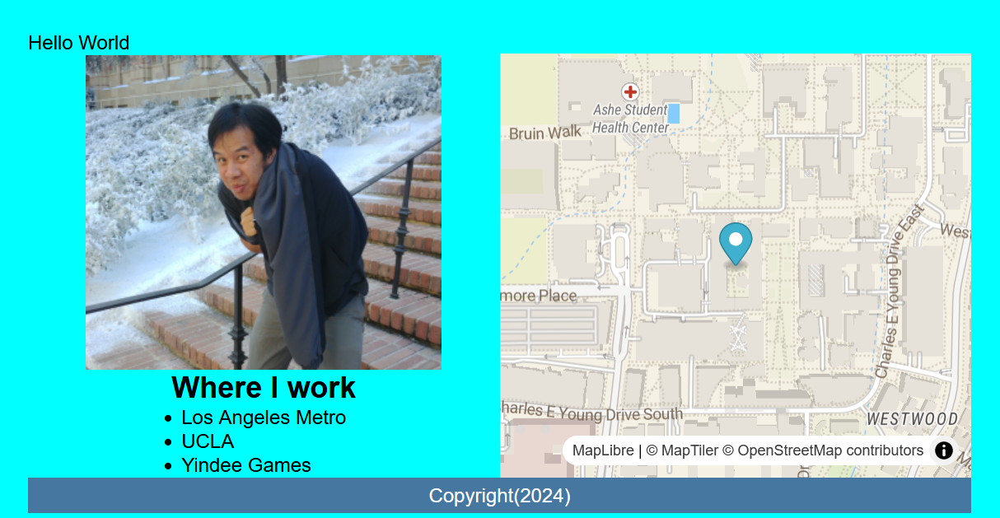

# MapLibRevisiting Portfolios

{: style="max-width:300px"}

## Objectives

!!! tldr "Goals"
    - Get an API Key
    - Add some markers and popups to your map
    - Styling your portfolio

## Outline

1. [The (API) KEY to BaseMaps](./m0.md)
2. [Adding Markers and styling Popups](./m1.md)
3. [Styling your portfolio](./m2.md)
4. [Final Lab Code](./m3.md)

This lab serves as an opportunity to revisit your portfolio and style it a bit more before turning it in on Wednesday. You will be adding markers and popups to your map, as well as styling your portfolio to make it look more professional.

