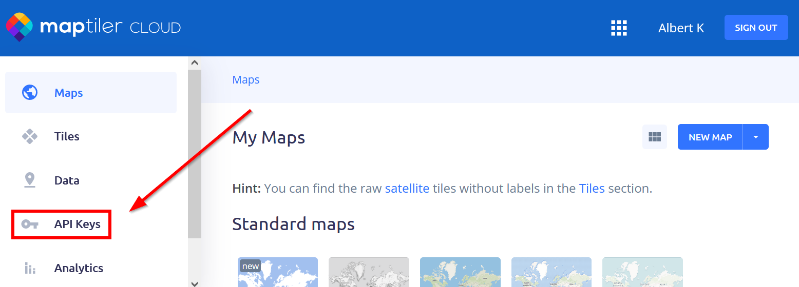
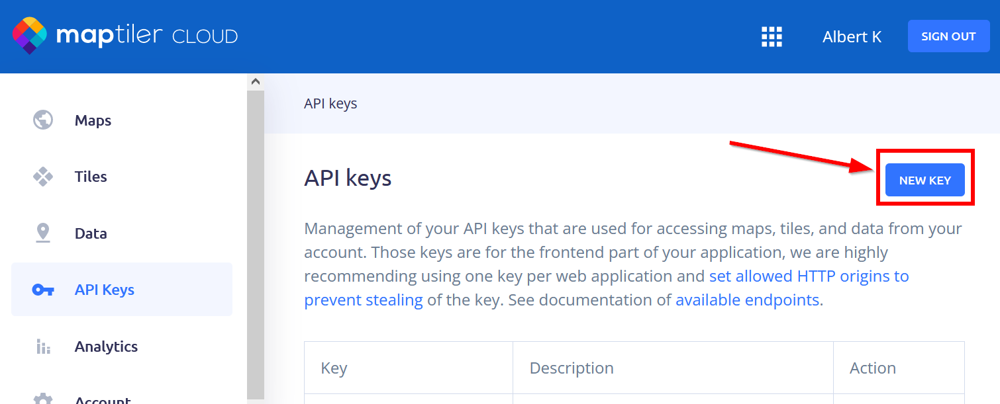
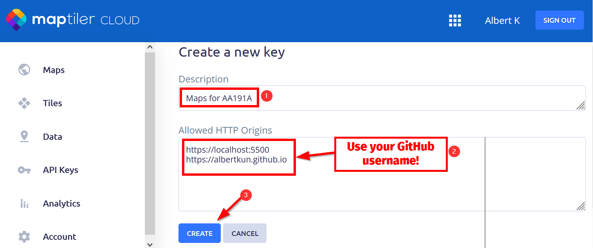
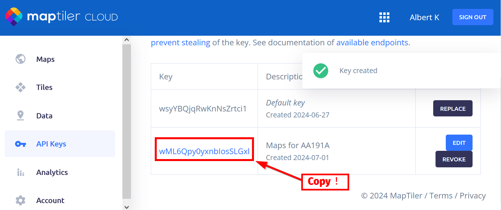
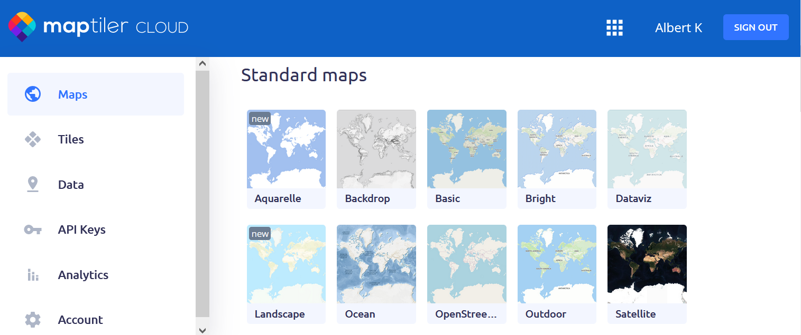
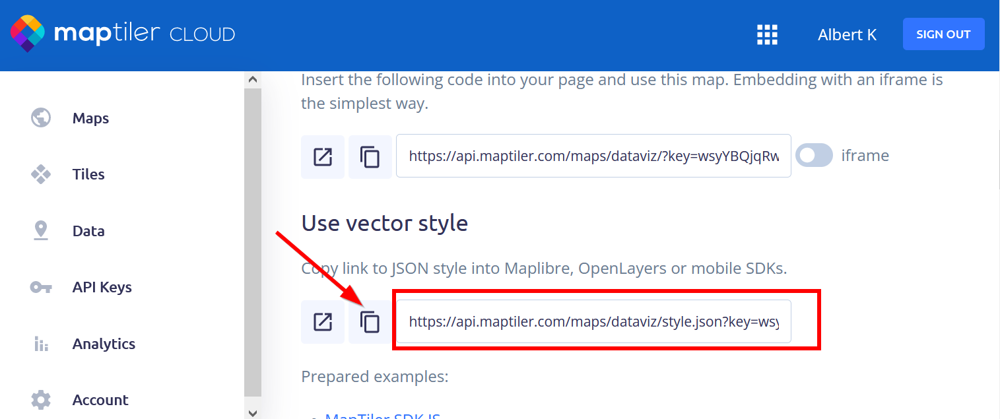

# The (API) KEY to BaseMaps

MapLibreGL is a powerful tool that allows you to create beautiful maps. However, it requires an API key to access the base maps. In this lab, you will learn how to get an API key and use it in your code.

You may have noticed that I provided an API key in the email sent last week:

=== "After fix"
	```js
	// Initialize the map
	const map = new maplibregl.Map({
		container: 'map', // container ID
		style: 'https://api.maptiler.com/maps/streets/style.json?key=wsyYBQjqRwKnNsZrtci1', // Your style URL
		center: [-118.45, 34.05], // Starting position [lng, lat]
		zoom: 12 // Starting zoom level
	});
	```

=== "Before fix"

	```js
	// Initialize the map
	const map = new maplibregl.Map({
		container: 'map', // container ID
		style: 'https://api.maptiler.com/maps/streets/style.json?key=get_your_own_OpIi9ZULNHzrESv6T2vL', // Your style URL
		center: [-118.45, 34.05], // Starting position [lng, lat]
		zoom: 12 // Starting zoom level
	});
	```

Unfortunately, this key used last week was not valid `get_your_own_OpIi9ZULNHzrESv6T2vL` for the web, sorry about that!

While you can use my key: `wsyYBQjqRwKnNsZrtci1` for now, it is recommended that you get your own API key. This will allow you to use MapLibreGL in your projects without any restrictions and not depend on my key when I change or remove it!

## Getting an API Key

To get an API key, you need to sign up for a free account on [MapTiler](https://www.maptiler.com/). Once you have signed up, you can generate an API key by following these steps:

1. Log in to your MapTiler account.

2. Click on the `API` tab in the top menu.

{: style="max-width:500px"}

1. Click on the `New Key` button.

{: style="max-width:500px"}

2. Enter a `Description`for your API key (e.g., `MapLibreGL Key for AA191A`).
3. Under `Allowed HTTP Origins` add the following:
	-  `https://localhost:5500`
	-  `https://YOUR_GITHUB_USERNAME.github.io` (e.g. `https://albertkun.github.io`)


!!! info "What is a `domain`"
	A domain is the address of a website, such as `localhost` or `github.io`. By restricting your API key to specific domains, you can control where it can be used. You also buy a domain name to make your website more professional, like `www.albert.com` but they need to be unique and you need to pay for them. Read more on MDN here: [Understanding domain names](https://developer.mozilla.org/en-US/docs/Learn/Common_questions/What_is_a_domain_name)

	After following those steps, your API key will only work on the specified domains, which is the localhost and your GitHub Pages site. This will help protect your key from unauthorized use.
 
6. Check to see if your settings are similar to this and then click on the `Create` button.

{: style="max-width:500px"}


7. Copy your API key

{: style="max-width:500px"}

8. and paste it into your code here

```js title="js/init.js"
// Initialize the map
const map = new maplibregl.Map({
	container: 'map', // container ID
	style: 'https://api.maptiler.com/maps/streets/style.json?key=YOUR_KEY_GOES_HERE', // Style URL with your API key
	center: [-118.45, 34.05], // Starting position [lng, lat]
	zoom: 12 // Starting zoom level
});
```

8. Save your changes and refresh the page.
9.  You should now see the base map displayed on your map.

### Changing the base map

Now that you have your own API key, you can change the base map to any style you like. You can find a list of available styles on the [MapTiler website](https://cloud.maptiler.com/maps/).

{: style="max-width:500px"}

Once you find one your like (you can even create your own now!), you can scroll down to the bottom of the page to find the `Style URL` that you can use in your code, by copying it:

{: style="max-width:500px"}

For example:

`https://api.maptiler.com/maps/streets-v2-light/style.json?key=wsyYBQjqRwKnNsZrtci1`

Now, just paste that `style` URL in your code with the style you want to use into our `map` object like this:

```js title="js/init.js"
// Initialize the map
const map = new maplibregl.Map({
	container: 'map', // container ID
	style: 'https://api.maptiler.com/maps/streets-v2-light/style.json?key=wsyYBQjqRwKnNsZrtci1', // Style URL with your API key
	center: [-118.45, 34.05], // Starting position [lng, lat]
	zoom: 12 // Starting zoom level
});
```
