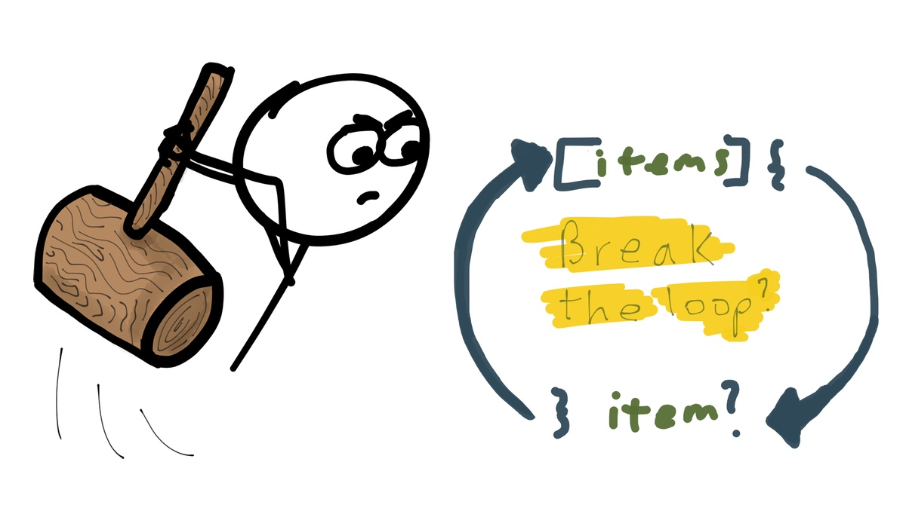
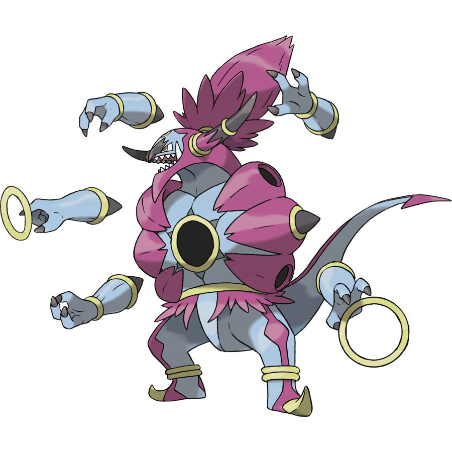
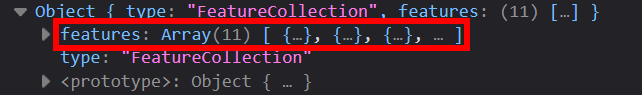
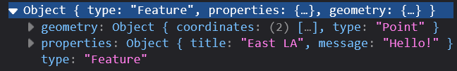
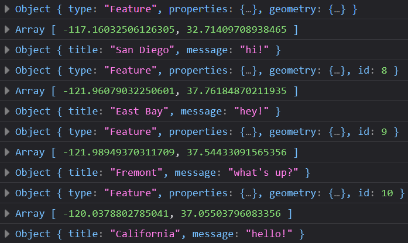

# For-hoops

Let's take a break from our mapping code and focus on the `for-loop` and `forEach` loop in JavaScript. These loops are critical for automating tasks and are the backbone of programming.

## What is a `for-loop`?

A `for-loop` means is to `go through the items and do something each time`. Loops are one of the most critical tool for programmers for automating tasks.

!!! warning "Note!!"
    The following `for-loop` is visualized for demonstration purposes only, please keep the **beginning** your loops to one single line for easier readability. Start a line break after the first `{`.
    
    For example (correct way to start a loop):

    ```js
    for (let i = 0; i < myArray.length; i++) {
        // do your loop here
    }
    ```

```js title="Example for-loop for demo ONLY!"
  let myArray = ['hello','this','is','an','array']
  for ( //(1)!
        let i = 0; //(2)!
        i < myArray.length; //(3)!
        i++){ //(4)!
          // loop through something 
		  // you can access `[i]` to get the current item in the array
        } //(5)!
```

1.         `for` is a keyword for starting the `for loop`
2.         `(let i = 0;` is a placeholder variable for counting, `i` can be anything, but it has be consistent in the `for loop`.
3.         `i < myArray.length` basically says, "run this loop as long as it is less than the content in myArray."
4.         `i++` means keep adding while the loop is able to run
5.         `{}` and finally the brackets are the code block to execute while the loop runs.

This is the basic example of a `for` loop. 

When the loop ends, we say that the loop is broken out of:



In the diagram above, notice that `myArray` is a [JavaScript array](https://developer.mozilla.org/en-US/docs/Web/JavaScript/Reference/Global_Objects/Array). When the array hits the last item, the loop stops. 

Or in the case of hoopa, it is `hoopa`-unbound:



But actually, hoopa would is better suited to multiple dimensions, right?

### Multidimensional Arrays

Well, in the example above, `myArray` is a one-dimensional array, meaning it is a list of items with one set of brackets:

```js
let myArray = ['hello','this','is','an','one-dimensional','array']
```

However, most of the time, we will be working with multidimensional arrays, which are arrays within arrays. The term we use for this is `nested` or `multidimensional` arrays.

Here is an example of a multidimensional array with latitude and longitude values:

```js
const sampleDataArray = [[37,-122],[32,-118],[39,-119],[36,-120]]
```

We can even add properties, like a name and a description to each item in the array:

```js
const sampleDataArray = [[37,-122,'Wow!','This is the first marker in our array!'],[32,-118,'Nice!','Another marker in our array?!!'],[39,-119,'OMG!','This is marker 3!'],[36,-120,'Too cool!','Is this marker 4 school!']]
```

!!! note "Order and getting disarrayed: problems with arrays"
    While arrays (like `let thisArray=[0,2,9]`) are great for storing data, they are not the best for accessing data because they do not store the name of the field or data!! This means you have to remember the order of the data in the array to access or use them. 
	
	For example, notice how we have to remember that the first item in the array is the `latitude` and the second item is the `longitude` in the `sampleDataArray` above.  This is why we use typically use **objects** that look like this: `let thisObject = {'latitude':37,'longitude':-122}` to store data, so we can access the data by name, not by order!

## Iterable Items

Arrays, whether **single dimensional** or **multidimensional** are considered as `iterable` items.

Loops can **ONLY be done on iterable items** (variables that you can count or go through), like numbers, lists, objects, and arrays.

### Accessing multidimensional array data

To access the data within a multidimensional array, you can use the following syntax:

```js
const sampleDataArray = [[37,-122,'Wow!','This is the first marker in our array!'],[32,-118,'Nice!','Another marker in our array?!!'],[39,-119,'OMG!','This is marker 3!'],[36,-120,'Too cool!','Is this marker 4 school!']]

sampleDataArray[0] // returns [37,-122,'Wow!','This is the first marker in our array!']
sampleDataArray[0][0] // returns 37
sampleDataArray[0][1] // returns -122
sampleDataArray[0][2] // returns 'Wow!'
sampleDataArray[0][3] // returns 'This is the first marker in our array!'
```

If you are doing this in a `for-loop` that is using `i` as the counter, you can use the `i` to access the data in the array:

```js
const sampleDataArray = [[37,-122,'Wow!','This is the first marker in our array!'],[32,-118,'Nice!','Another marker in our array?!!'],[39,-119,'OMG!','This is marker 3!'],[36,-120,'Too cool!','Is this marker 4 school!']]

for (let i = 0; i < sampleDataArray.length; i++) {
	console.log(sampleDataArray[i]) // returns [37,-122,'Wow!','This is the first marker in our array!']
	console.log(sampleDataArray[i][0]) // returns 37
	console.log(sampleDataArray[i][1]) // returns -122
	console.log(sampleDataArray[i][2]) // returns 'Wow!'
	console.log(sampleDataArray[i][3]) // returns 'This is the first marker in our array!'
}
```

Notice that in arrays, the order that the information is stored **MUST** be consistent or will lead to problems in using the data!

### ⚽In-class Exercise #3 - Our First Loop

```js title="Sample array for exercise"

const sampleDataArray = [[37,-122,'Wow!','This is the first marker in our array!'],[32,-118,'Nice!','Another marker in our array?!!'],[39,-119,'OMG!','This is marker 3!'],[36,-120,'Cool!','The marker is too cool 4 school!']]
```

!!! tldr "Tasks"
    1. Using the array above, make a `for-loop` that creates markers!  

??? done "Answer"
    ```js
		const sampleDataArray = [[37,-122,'Wow!','This is the first marker in our array!'],[32,-118,'Nice!','Another marker in our array?!!'],[39,-119,'OMG!','This is marker 3!'],[36,-120,'Cool!','The marker is too cool 4 school!']]

        for (let i = 0; i < sampleDataArray.length; i++) { //(1)!
            console.log(sampleDataArray[i]) //(2)!
            addMarker(sampleDataArray[i][0],sampleDataArray[i][1],`${sampleDataArray[i][2]}`,`sampleDataArray[i][3]`) //(3)!
        }
    ```
    1.      This starts the loop by saying, `for the total length in our sampleDataArray` do something
    2.      The `console.log()` checks our loop results. Warning, doing this for large datasets will slow down your website, so use this mainly for debugging purposes.
    3.      We call the `addMarker()` function with the `sampleDataArray[i]` being the number that the loop is currently on. We use `sampleDataArray[i][0]` to get `latitude` and `sampleDataArray[i][1]` for longitude.

### `For...of` loop

The [for of](https://developer.mozilla.org/en-US/docs/Web/JavaScript/Reference/Statements/for...of) loop is identical in function to the `for-loop` except that it does not have an automatically `iterating` variable. Since it has less variables, I think it is much easier to understand than the basic `for` loop.

Here is the `for-of` loop in action:

```js
const longString = 'hellooooooooooooo'
const array1 = ['a', 'b', 'c'];

// this loops through an array
for (const stuff of array1){
    console.log(stuff)
}

// this loops through a string!
for (const letter in longstring){
    console.log(letter)
}
```
Do note that the `for...of` loops works for arrays, but the `for-in` syntax is used to loop through strings or objects!

You can use any variable name in place of `letter` or `stuff` so long as you are clear about what is being looped over inside the scope brackets.

### ⚽In-class Exercise #4 - `For-of` Loop

```js title="Sample array for exercise"

const sampleDataArray = [[37,-122,'Wow!','This is the first marker in our array!'],[32,-118,'Nice!','Another marker in our array?!!'],[39,-119,'OMG!','This is marker 3!'],[36,-120,'Cool!','The marker is too cool 4 school!']]

```

!!! tldr "Tasks"
    1. Re-write our first `for-loop`, with a`for-of` loop that also creates markers!  

??? done "Answer"
    ```js
		const sampleDataArray = [[37,-122,'Wow!','This is the first marker in our array!'],[32,-118,'Nice!','Another marker in our array?!!'],[39,-119,'OMG!','This is marker 3!'],[36,-120,'Cool!','The marker is too cool 4 school!']]

        for (const item of sampleDataArray){
            addMarker(item[0],item[1],`${item[2]}`,`${item[3]}`)
        }
    ```

Notice in the answer, there is no `automatic` increasing value, so we need to pass the `item` in as the value for the pop-up message! 

I think **FOR** my ease of understanding the code, not having to auto-increment (the `i++`) is a worthwhile trade-off!!!

## `For Each` loop

Out of `each` of the loops, the `for each` loop is the final and most important loop we will cover today. It is similar to the loops above, but there are two key differences:

1. **`.forEach`** requires a function
2. **`.forEach`**is an ==`array` method== or ==built-in function== for arrays- so it only **works on arrays**!!!!

Those differences are important because when this loop executes a function for each array element. Also, since this `loop` is an array method, it doesn't start with a keyword!!

Instead `.forEach()` follows the array that you want to call the loop on.

Here is an example of the `forEach` loop:

```js hl_lines="3"
let myArray = ['hello','this','is','an','array']

myArray.forEach(justChecking);

function justChecking(data){
    console.log(data)
}
```

The `.forEach` method might be the easiest loop to understand because of the grammar implications:

`For Each`->`item in the array`-> `do this function!`

Additionally, the `.forEach()` loop is important because it streamlines the process of applying a function to a list of items. This is a common scenario with **arrays** (lists) in the first place, since no one wants to program things by manually applying a function to hundres of items!!

One draw back of using `.forEach()` in this way is that you can't isolate the data paramaters in a function.

For example, this code will not work!

!!! error "forEach broken"
    ```js 
    const sampleDataArray = [{'lat':37,'lng':-122,'title':'Wow!','message':'This is the first marker in our array!'},{'lat':32,'lng':-118,'title':'Nice!','message':'Another marker in our array?!!'},{'lat':39,'lng':-119,'title':'OMG!','message':'This is marker 3!'},{'lat':36,'lng':-120,'title':'Cool!','message':'The marker is too cool 4 school!'}]

    sampleDataArray.forEach(justChecking(lat,lng));
    
    function justChecking(lat,lng){
        console.log(lat,lng)
    }
    ```
You would have to write the code this way:

!!! done "forEach fixed"
    ```js 
    const sampleDataArray = [{'lat':37,'lng':-122,'title':'Wow!','message':'This is the first marker in our array!'},{'lat':32,'lng':-118,'title':'Nice!','message':'Another marker in our array?!!'},{'lat':39,'lng':-119,'title':'OMG!','message':'This is marker 3!'},{'lat':36,'lng':-120,'title':'Cool!','message':'The marker is too cool 4 school!'}]

    sampleDataArray.forEach(justChecking);
    
    function justChecking(data){
        console.log(data.lat,data.lng)
    }
    ```

One way to be able to specify data values with **`.forEach()`** is to use the arrow functions!!

## `.forEach()` and arrow (`=>`) functions revisited

Since a `.forEach()` loop requires a function, if the function is not needed anywhere else, it is recommended to simplify the loop with an arrow/anonymous function, which we covered in the previous module.

Of course, always stick with what you think makes the most sense to **you** as a coder!

Remember, an [anonymous function](https://developer.mozilla.org/en-US/docs/Web/JavaScript/Reference/Functions/Arrow_functions) is a function without a name and uses the `=>` (arrow) syntax.

Here is how the same `forEach()` loop looks like with an arrow function:

```js
const sampleDataArray = [{'lat':37,'lng':-122,'title':'Wow!','message':'This is the first marker in our array!'},{'lat':32,'lng':-118,'title':'Nice!','message':'Another marker in our array?!!'},{'lat':39,'lng':-119,'title':'OMG!','message':'This is marker 3!'},{'lat':36,'lng':-120,'title':'Cool!','message':'The marker is too cool 4 school!'}]

sampleDataArray.forEach(data=>{justChecking(data)});

function justChecking(data){
    console.log(data)
}
```

Adding the arrow function allows you to use multiple parameters in the function call to treat the `data` from `sampleDataArray` as if it were an object, like so: `sampleDataArray.lat`, or `sampleDataArray.lng`

```js
const sampleDataArray = [{'lat':37,'lng':-122,'title':'Wow!','message':'This is the first marker in our array!'},{'lat':32,'lng':-118,'title':'Nice!','message':'Another marker in our array?!!'},{'lat':39,'lng':-119,'title':'OMG!','message':'This is marker 3!'},{'lat':36,'lng':-120,'title':'Cool!','message':'The marker is too cool 4 school!'}]

sampleDataArray.forEach(data=>{addMarker(data.lat,data.lng,data.title,data.message)});

```

## `.` (dot) notation vs. `[]` (bracket) notation

Remember to access an **object** you typically would use the `.nameOfField` (**dot**) notation like so:

`arrayOfObjects.forEach(data => {data.name})`

But if there are spaces in the field name, you will have to use the `['name of field']` (**bracket**) notation.

In the above example we can call `arrayOfObjects.forEach(data => {data['name']})` to access all of the name values in our data.

Here is how the `forEach` loop would look like with the `.` (dot) notation:

```js
let arrayOfObjects = [{'name':'hello','lat':37,'lng':-122},{'name':'world','lat':35,'lng':-119},{'name':'aa191','lat':36,'lng':-120}]

arrayOfObjects.forEach(feature => {
	addMarker(feature.lat,feature.lng,feature.name,'This is marker ${data.name}')
})
```

Personally, I prefer this over the other loop methods because it is easier to read and understand.


### ⚽Class Exercise #5 - Your first `forEach` loop


```js title="Sample array of objects for exercise"
let simpleArray = ['hello','this','is','an','array']
const arrayOfObjects = [{'lat':37,'lng':-122,'title':'Wow!','message':'This is the first marker in our array!'},{'lat':32,'lng':-118,'title':'Nice!','message':'Another marker in our array?!!'},{'lat':39,'lng':-119,'title':'OMG!','message':'This is marker 3!'},{'lat':36,'lng':-120,'title':'Cool!','message':'The marker is too cool 4 school!'}]

```

!!! tldr "Tasks"
    1. Create an [array](https://developer.mozilla.org/en-US/docs/Web/JavaScript/Reference/Global_Objects/Array) of objects 3 or more items
    2. Use a `.forEach()` loop on one of the arrays above.
    3. `console.log()` the result.
    4. Try to use a `forEach` loop to create the markers instead!  

??? done "Answer"
    ```js
        let simpleArray = ['hello','this','is','an','array']

        simpleArray.forEach(checking)

        function checking(aParameter){
            console.log(aParameter)
        }

		const arrayOfObjects = [{'lat':37,'lng':-122,'title':'Wow!','message':'This is the first marker in our array!'},{'lat':32,'lng':-118,'title':'Nice!','message':'Another marker in our array?!!'},{'lat':39,'lng':-119,'title':'OMG!','message':'This is marker 3!'},{'lat':36,'lng':-120,'title':'Cool!','message':'The marker is too cool 4 school!'}]

        for (const item of sampleDataArray){
            addMarker(item[0],item[1],`Marker ${item}`,`This is marker ${item}`)
        }

		arrayOfObjects.forEach(data=>{addMarker(data.lat,data.lng,data.title,data.message)});		
    ```


## Turning our geojson data into markers

There are numerous approaches that one can take using any of the loop methods described above, we will just focus on the `.forEach()` and `=>` implmenetion.

### Returning to our `processData()` function

Now that we have a better understanding of loops, we can return to our `processData()` function and add the `addMarker()` function to the loop.

First, let's make sure that our data is being processed correctly by adding `console.log()` statements to the function:

```js
function processData(results){
    console.log(results) //for debugging: this can help us see if the full set of results
}
```

Notice how we are using the `results` variable to access the data, but there are two keys in the geojson, `type` and `features`. We are interested in the `features` key, which is an array of data points:



Also, notice that the `features` array is an array of objects, so we can use the `forEach()` loop to access the data in the array!!

Now when you open the console it should show the full set of results in there!


### Traversing and accessing the data

Now that we know the structure of the data, we can access the data in the `features` array by using the `feature` variable in the `.forEach()` loop. (Note: Like the `i` in the `for-loop`, `feature` can be anything, but it has to be consistent within the `forEach` loop you are using.)

```js
function processData(results){
	//console.log(results) //for debugging: this can help us see if the results are what we want
	results.features.forEach(feature => {
		console.log(feature) // for debugging: are we seeing each feature correctly?
	})
}
```

Doing this gives us our GeoJSON data in the console:



This should return the full set of results and each data point in the console! Since our data is a geojson, the data should be in the `features` array, and what we are interested in is the `geometry` and `properties` fields.

!!! note "GeoJSON structure"
	- `type` is the type of data, which is `FeatureCollection` in this case
	- `features` is the array of data points
	- each `feature` is an object with `geometry` and `properties` fields
        - `geometry` is the coordinates of the point and contains `coordinates` which is an array of `[longitude,latitude]`
        - `properties` is the data associated with the point, and contains `title` and `message` fields (or whatever else you authored in your geojson)

```js
function processData(results){
	console.log(results) //for debugging: this can help us see if the full set of results 
	results.features.forEach(feature => {
		console.log(feature) // for debugging: are we seeing each feature correctly?
		console.log(feature.geometry.coordinates) // for debugging: are we seeing the coordinates correctly?
		console.log(feature.properties) // for debugging: are we seeing the properties correctly?
	})
}
```

!!! note "OMG!! The `.` returns?!"
    Notice the dots in `feature.geometry.coordinates`?! Similar to `chaining` methods, we use the `.` to chain going down an `object` path. Why is that?! Well.. It has something to do with `classes`, but thats out of the `scope` of this class. (multiple coding puns intended.) If you really want to learn more, click here to read about Object-Oriented Programming and JavaScript: [click if you dare!](https://developer.mozilla.org/en-US/docs/Learn/JavaScript/Objects/Classes_in_JavaScript).

If this works and you see the data in the console, click into the array to see if our data looks right:



!!! important "Remember! `console.log()` is your life boat! :fontawesome-solid-life-ring:"
    Always check the console to see if our data and code is function properly!

If it looks correct, now we can call our `addMarker()` function in the loop and populate our map with our geojson features!

## Call the `addMarker()` function in a loop

With everything working correctly, let's call the `addMarker()` function in the `.forEach()` loop like so:

```js
function processData(results){
    //console.log(results) //for debugging: this can help us see if the results are what we want
    results.features.forEach(feature => {
        console.log(feature) // for debugging: are we seeing each feature correctly?
        // the console log can make sure we have the right field names selected!
        addMarker(feature.geometry.coordinates[1],feature.geometry.coordinates[0],feature.properties.title,feature.properties.message)
    })
}
```

Notice that the `geometry` field contains the `coordinates` field, which is an array of `[longitude,latitude]`. We access the `latitude` by using `feature.geometry.coordinates[1]` and the `longitude` by using `feature.geometry.coordinates[0]`. This is because `geojson` is stored in `[longitude,latitude]` format! If you want, you can actually make the loop more explicit like so:

```js
function processData(results){
	//console.log(results) //for debugging: this can help us see if the results are what we want
	results.features.forEach(feature => {
		//console.log(feature) // for debugging: are we seeing each feature correctly?
		// the console log can make sure we have the right field names selected!
		let coordinates = feature.geometry.coordinates;
		let longitude = coordinates[0];
		let latitude = coordinates[1];
		let title = feature.properties.title;
		let message = feature.properties.message;
		addMarker(latitude,longitude,title,message);
	});
};
```

And viola! Your map should now be populated with the points on the survey!

## 🏁Final check point

- Add a `forEach` loop to your `processData()` function
- Check and access the `geometry` and `properties` fields in the loop
- Make sure the `addMarker()` function is called in the loop

```js
// When the map is fully loaded, start adding GeoJSON data
map.on('load', function() {
    fetch("map.geojson")
        .then(response => response.json())
        .then(data => {
            processData(data); // Call processData with the fetched data
        });
});

function processData(results){
	//console.log(results) //for debugging: this can help us see if the results are what we want
	results.features.forEach(feature => {
		//console.log(feature) // for debugging: are we seeing each feature correctly?
		// the console log can make sure we have the right field names selected!
		let coordinates = feature.geometry.coordinates;
		let longitude = coordinates[0];
		let latitude = coordinates[1];
		let title = feature.properties.title;
		let message = feature.properties.message;
		addMarker(latitude,longitude,title,message);
	});
};
```


Now you are ready for the [lab assignment](../../assignments/week3/lab_assignment.md)!