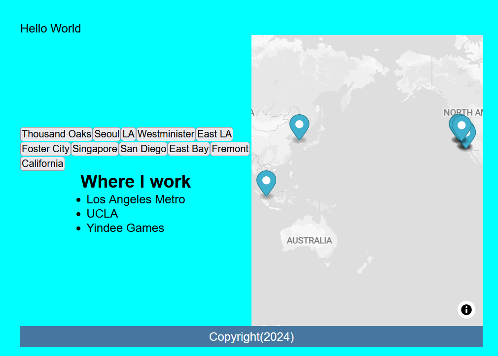

---
hide:
  - tags
tags:
  - Lab 3
  - GeoJSON
  - Buttons
  - Event Listeners
---
# For-hoops and Geo-J-cieON

Adding functionality to our [MapLibreGL](https://maplibre.org/maplibre-gl-js/docs/)

{: style="max-width:300px"}

!!! tldr "Goals"
    - Create a GeoJSON online and it to the map with JavaScript
    - Understand how JavaScript works with HTML and CSS
    - Understand how JavaScript variables, functions, methods work together


## Lab Outline

1. [Creating a GeojSON](1.md)
2. [Fetch and then statements](2.md)
3. [For-Loops](3.md)


## Starting Template Code for lab #3

Use the following template code or your lab assignment #2:


```html title="index.html" linenums="1"
<!DOCTYPE html>
<html>
    <head>
        <title>Hello World with MapLibreGl</title>
        <!-- hint: remember to change your page title! -->
        <meta charset="utf-8" />
        <link rel="shortcut icon" href="#">
        <link rel="stylesheet" href="styles/style.css">

        <!-- MapLibreGL's css-->
        <link rel="stylesheet" href="https://unpkg.com/maplibre-gl/dist/maplibre-gl.css" />

		<!-- MapLibreGL's JavaScript-->
		<script src="https://unpkg.com/maplibre-gl/dist/maplibre-gl.js"></script>
    </head>
    
    <body>
        <header>
			Hello World
            <!-- hint: you can make a menu with other links here if you'd like -->
        </header>
        
        <main>
			<div class="portfolio">
				<div id="contents"></div>
				<!-- Portfolio content goes here -->
				 <h2>Where I work</h2>
				 <ul>
					 <li>Los Angeles Metro</li>
					 <li>UCLA</li>
					 <li>Yindee Games</li>
				 </ul>
			</div>
            <div id="map"></div>
        </main>
        <div id="footer">
            Copyright(2024)
        </div>
        <script src="js/init.js"></script>
    </body>
</html>
```

```css title="styles/style.css" linenums="1"


```

```js title="js/init.js" linenums="1"
// Initialize the map
const map = new maplibregl.Map({
    container: 'map',
    style: 'https://api.maptiler.com/maps/streets-v2-light/style.json?key=wsyYBQjqRwKnNsZrtci1',
    center: [-118.4430,34.0691],
    zoom: 15
});

function addMarker(lat,lng,title,message){
	let popup_message = `<h2>${title}</h2> <h3>${message}</h3>`
	new maplibregl.Marker()
		.setLngLat([lng, lat])
		.setPopup(new maplibregl.Popup()
			.setHTML(popup_message))
		.addTo(map)
	createButtons(lat,lng,title);
	return message
}

function createButtons(lat,lng,title){
    const newButton = document.createElement("button"); 
    newButton.id = "button"+title; 
    newButton.innerHTML = title; 
    newButton.setAttribute("lat",lat); 
    newButton.setAttribute("lng",lng); 
    newButton.addEventListener('click', function(){
        map.flyTo({
			center: [lng,lat],
		})
    })
    document.getElementById("contents").appendChild(newButton);
}
```
