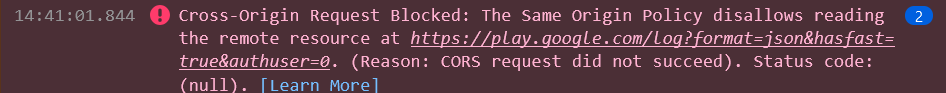
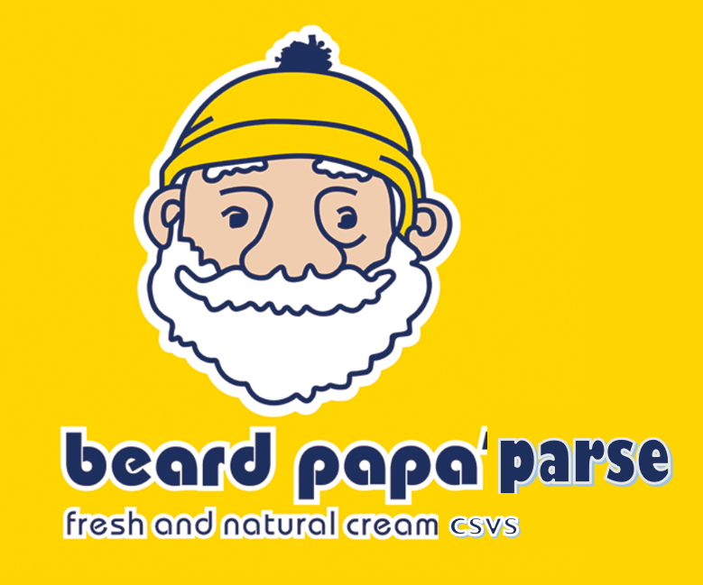

# Connecting to APIs and Looping back to Lab 3!

Remember from last week's lab about loops that in order to loop, we need data to loop over! So let's get our data from Google Sheets using their Application Programming Interface (API).

## What's an API?

An [API](https://developer.mozilla.org/en-US/docs/Learn/JavaScript/Client-side_web_APIs/Introduction) can be really thought of as an external appliance we are borrowing. In that sense, we are just plugging into it so we can access the data it provides.

Basically, an API allows different websites, computer devices, and data talk to each other.

{: style="max-width:500px"}

### Boo!!! Google's API Depreciation!

Unforunately, in 2021 Google Depreciated the API for connecting to their files directly. So remember that error from the [previous module](./2)? 

{: style="max-width:500px"}

We will have to do a work around, which means we won't be using the built-in JavaScript `fetch API`.

Instead we will use an open-source library called...

## Sweet, (beard) `papa-parse`!

[{: style="max-width:500px"}](https://www.papaparse.com/)

[**`papa parse`**](https://www.papaparse.com/)

### Adding `papa parse` to our html

We want to bring the library of sweet pastries into our site, so let's bring in `papa parse` directly online like we did with **MapLibreGL.js** in lab 1!

Copy the following code and paste it into your `<head>` tag in your `index.html` file:

```js
<script src="https://cdnjs.cloudflare.com/ajax/libs/PapaParse/5.3.0/papaparse.min.js"></script>
```

Your `index.html` should look like this:

```html linenums="10" hl_lines="6" title="index.html"
        <!-- MapLibreGL's css-->
        <link rel="stylesheet" href="https://unpkg.com/maplibre-gl/dist/maplibre-gl.css" />

		<!-- MapLibreGL's JavaScript-->
		<script src="https://unpkg.com/maplibre-gl/dist/maplibre-gl.js"></script>
		<script src="https://cdnjs.cloudflare.com/ajax/libs/PapaParse/5.3.0/papaparse.min.js"></script>
    </head>
```

With `papa parse` added to our site, we can now use it to connect to our Google Sheet.

### Connecting to our Google Sheet with `papa parse`

Go into our `init.js` and change out the `fetch` in the `loadData()` function to the following:

```js 
map.on('load', function() {
    // Use PapaParse to fetch and parse the CSV data from a Google Forms spreadsheet URL
    Papa.parse(dataUrl, {
        download: true, // Tells PapaParse to fetch the CSV data from the URL
        header: true, // Assumes the first row of your CSV are column headers
        complete: function(results) {
            // Process the parsed data
           console.log(results)
        }
    });
});
```

Let's open up our console and see if our data is loaded!

If you see this:

{: style="max-width:500px"}

Then you are in good shape for the next part of the lab!

### ⚽ Warm-up: Arrow Functions!

!!! tldr "Can you convert the function?"
    Arrow functions help to cut down our code and make it easier to read. Are you able to convert the function below to an `arrow =>` function?

```js 
map.on('load', function() {
    Papa.parse(dataUrl, {
        download: true,
        header: true,
        complete: function(results) {
            processData(results.data);
        }
    });
});
```

??? done "Answer"

    ```js 
	map.on('load', function() {
		Papa.parse(dataUrl, {
			download: true,
			header: true,
			complete: (results) => {
				processData(results.data);
			}
		});
	});
    ```

Since our data is showing up in our console, we can now start our next conditionALab!

## 🏁Checkpoint

Check to see if your code is like the following before moving on:

```html title="index.html" linenums="1" hl_lines="15"
<!DOCTYPE html>
<html>
    <head>
        <title>Hello World with MapLibreGl</title>
        <!-- hint: remember to change your page title! -->
        <meta charset="utf-8" />
        <link rel="shortcut icon" href="#">
        <link rel="stylesheet" href="styles/style.css">

        <!-- MapLibreGL's css-->
        <link rel="stylesheet" href="https://unpkg.com/maplibre-gl/dist/maplibre-gl.css" />

		<!-- MapLibreGL's JavaScript-->
		<script src="https://unpkg.com/maplibre-gl/dist/maplibre-gl.js"></script>
		<script src="https://cdnjs.cloudflare.com/ajax/libs/PapaParse/5.3.0/papaparse.min.js"></script>
    </head>
    
    <body>
        <header>
			COVID Vaccination Stories
        </header>
        
        <main>
			<div class="portfolio">
				<div id="contents">
				</div>
				<iframe src="https://docs.google.com/forms/d/e/1FAIpQLSfcElv5dlXInR7XHQz27_OcYJlWcIUr-GBbc-ocefWlGd1uXg/viewform?embedded=true" width="100%" height="100%" frameborder="0" marginheight="0" marginwidth="0">Loading…</iframe>
			</div>
            <div id="map"></div>
        </main>
        <div id="footer">
            Copyright(2024)
        </div>
        <script src="js/init.js"></script>
    </body>
</html>
```

```js title="js/init.js" linenums="1" hl_lines="38-47"
// declare variables
let mapOptions = {'centerLngLat': [-118.444,34.0709],'startingZoomLevel':5}

const map = new maplibregl.Map({
	container: 'map', // container ID
	style: 'https://api.maptiler.com/maps/streets-v2-light/style.json?key=wsyYBQjqRwKnNsZrtci1', // Your style URL
	center: mapOptions.centerLngLat, // Starting position [lng, lat]
	zoom: mapOptions.startingZoomLevel // Starting zoom level
});

function addMarker(lat,lng,title,message){
	let popup_message = `<h2>${title}</h2> <h3>${message}</h3>`
	new maplibregl.Marker()
		.setLngLat([lng, lat])
		.setPopup(new maplibregl.Popup()
			.setHTML(popup_message))
		.addTo(map)
	createButtons(lat,lng,title);
	return message
}

function createButtons(lat,lng,title){
    const newButton = document.createElement("button");
    newButton.id = "button"+title;
    newButton.innerHTML = title;
    newButton.setAttribute("lat",lat);
    newButton.setAttribute("lng",lng);
    newButton.addEventListener('click', function(){
        map.flyTo({
			center: [lng,lat],
		})
    })
    document.getElementById("contents").appendChild(newButton);
}

const dataUrl = "https://docs.google.com/spreadsheets/d/e/2PACX-1vSNq8_prhrSwK3CnY2pPptqMyGvc23Ckc5MCuGMMKljW-dDy6yq6j7XAT4m6GG69CISbD6kfBF0-ypS/pub?output=csv"

map.on('load', function() {
    // Use PapaParse to fetch and parse the CSV data from a Google Forms spreadsheet URL
    Papa.parse(dataUrl, {
        download: true, // Tells PapaParse to fetch the CSV data from the URL
        header: true, // Assumes the first row of your CSV are column headers
        complete: results =>{
			processData(results.data) // Call processData with the fetched data
		}
    });
});

function processData(results){
	console.log(results) //for debugging: this can help us see if the results are what we want
	results.forEach(feature => {
		//console.log(feature) // for debugging: are we seeing each feature correctly?
		// assumes your geojson has a "title" and "message" attribute
		// let coordinates = feature.geometry.coordinates;
		let longitude = feature['lng']
		let latitude = feature['lat'];
		let title = feature['Where did you get vaccinated?'];
		let message = feature['What zip code do you live in?'];
		addMarker(latitude,longitude,title,message);
	});
};
```
