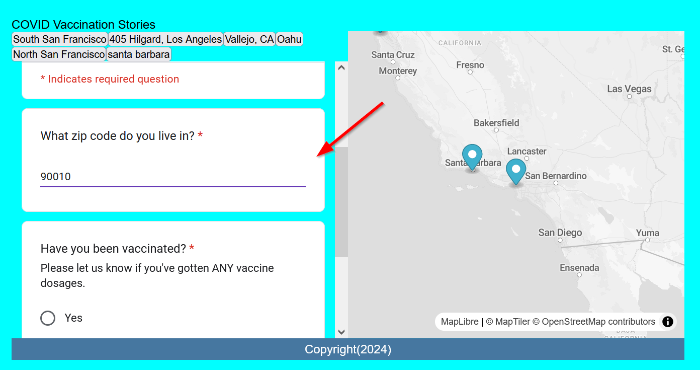
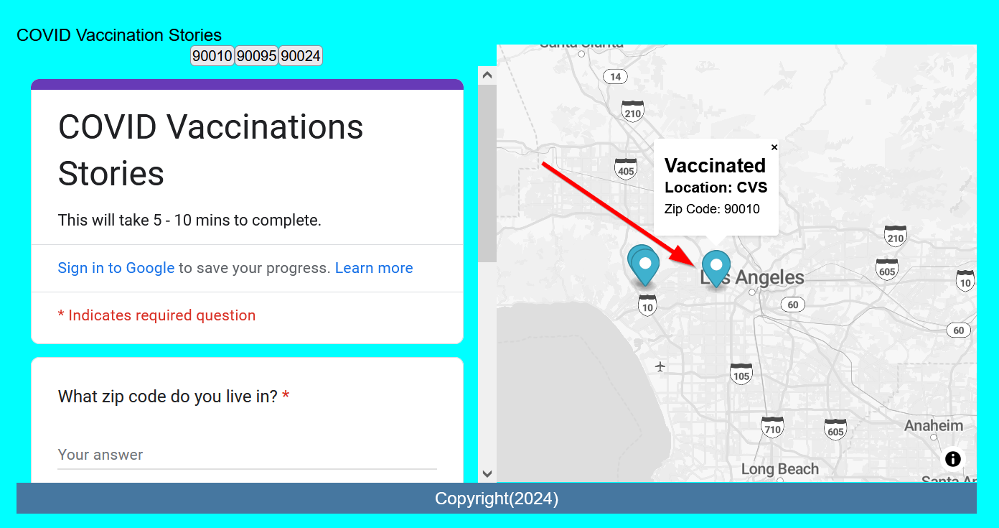

# What `IF` and `Condition`al-bert Puns Never end?

Conditional statements are important for being able to tell our code to **do** or **not do** something.

## ⚽ Warm-up: New Keywords?

In [part 2](2.md)'s Google Script Editor, we copy and pasted a large chunk of code without going into much detail about it. Let's now take sometime to analyze it.

```js title="Google's Script Editor" linenums="1"
function myFunction() {
    let sheet = SpreadsheetApp.getActiveSheet();
    
    let range = sheet.getDataRange();
    let cells = range.getValues();
    
    let latitudes = [['lat']]; //(1)!
    let longitudes = [['lng']]; //(2)!
    
    for (let i = 0; i < cells.length; i++) {
        // change cells[i][2] if your address is not in column 'C', for example cells[i][1] for column 'B' or cells[i][3] for column D
        
        addressColumn = cells[i][2] //(3)!
        let lat = lng = 0;

        if (i > 0) {
            if (addressColumn){
                let address = addressColumn;
                console.log(address)
                if(address){
                    let geocoder = Maps.newGeocoder().geocode(address);
                    let res = geocoder.results[0];
                        if(res){
                            lat = res.geometry.location.lat;
                            lng = res.geometry.location.lng;
                            }
                        }
                    }
                latitudes.push([lat]);
                longitudes.push([lng]);
            }
    }
    sheet.getRange('D1') // this is your latitude column //(4)!
    .offset(0, 0, latitudes.length)
    .setValues(latitudes);
    sheet.getRange('E1') // this is your longitude column //(5)!
    .offset(0, 0, longitudes.length)
    .setValues(longitudes);
    Utilities.sleep(5000)
}
```

!!! tldr "Questions"
    1. What language is the Google Script Editor using? HTML? CSS? JavaScript?
    2. Were there any new built-in JavaScript methods?
    3. What new keywords (**if** any) did you see?
    4. If there were new keywords, do you think they do?


??? done "Answers"
    1. It is written in JavaScript
    2. There were quite a few, like `cells.length` and `Utilities.sleep(5000)` but these are all a part of Google Apps script. A built-in JavaScript method that is important to recognize was `latitudes.push([lat]);` and `longitudes.push([lng]);` which allows us to add content to a list to variables we created called `latitude` and `longitude`! Very useful and we will use this again soon!
    3. The new keyword was: `if`
    4. 
       a. `if` checks for a conditional statement

    ```js title="Google's Script Editor" linenums="1" hl_lines="10 16 17 20 23"

    function myFunction() {
        let sheet = SpreadsheetApp.getActiveSheet();
        
        let range = sheet.getDataRange();
        let cells = range.getValues();
        
        let latitudes = [['lat']]; //(1)!
        let longitudes = [['lng']]; //(2)!
        
        for (let i = 0; i < cells.length; i++) {
            // change cells[i][2] if your address is not in column 'C', for example cells[i][1] for column 'B' or cells[i][3] for column D
            
            addressColumn = cells[i][2] //(3)!
            let lat = lng = 0;

            if (i > 0) {
                if (addressColumn){
                    let address = addressColumn;
                    console.log(address)
                    if(address){
                        let geocoder = Maps.newGeocoder().geocode(address);
                        let res = geocoder.results[0];
                            if(res){
                                lat = res.geometry.location.lat;
                                lng = res.geometry.location.lng;
                                }
                            }
                        }
                    latitudes.push([lat]);
                    longitudes.push([lng]);
                }
        }
        sheet.getRange('D1') // this is your latitude column //(4)!
        .offset(0, 0, latitudes.length)
        .setValues(latitudes);
        sheet.getRange('E1') // this is your longitude column //(5)!
        .offset(0, 0, longitudes.length)
        .setValues(longitudes);
        Utilities.sleep(5000)
    }
    ```

### Reminder!!! `.` (dot) notation vs. `[]` (bracket) notation

Remember to access an **object** you typically would use the `.nameOfField` (**dot**) notation like so:

`arrayOfObjects.forEach(data => {data.name})`

But if there are spaces in the field name, you will have to use the `['name of field']` (**bracket**) notation.

In the above example we can call `arrayOfObjects.forEach(data => {data['name']})` to access all of the name values in our data.

[Please see lab 3 if you need a refresher on this!](../week3/3.md#dot-notation-vs-bracket-notation)

## ⚽Class Exercise #3- Using objects as a parameter

Given this JavaScript:


```js
	const dataUrl = "https://docs.google.com/spreadsheets/d/e/2PACX-1vSNq8_prhrSwK3CnY2pPptqMyGvc23Ckc5MCuGMMKljW-dDy6yq6j7XAT4m6GG69CISbD6kfBF0-ypS/pub?output=csv"

	// When the map is fully loaded, start adding GeoJSON data
	map.on('load', function() {
		// Use PapaParse to fetch and parse the CSV data from a Google Forms spreadsheet URL
		Papa.parse(dataUrl, {
			download: true, // Tells PapaParse to fetch the CSV data from the URL
			header: true, // Assumes the first row of your CSV are column headers
			complete: results =>{
				processData(results.data) // Call processData with the fetched data
			}
		});
	});

	function processData(results){
		console.log(results) //for debugging: this can help us see if the results are what we want
		results.forEach(feature => {
			//console.log(feature) // for debugging: are we seeing each feature correctly?
			let longitude = feature['lng']
			let latitude = feature['lat'];
			let title = feature['Where did you get vaccinated?'];
			let message = feature['What zip code do you live in?'];
			addMarker(latitude,longitude,title,message);
		});
	};

	function addMarker(lat,lng,title,message){
		let popup_message = `<h2>${title}</h2> <h3>${message}</h3>`
		new maplibregl.Marker()
			.setLngLat([lng, lat])
			.setPopup(new maplibregl.Popup()
				.setHTML(popup_message))
			.addTo(map)
		createButtons(lat,lng,title); // createButtons is unchanged!
		return message
	}

```

!!! tldr "Tasks"
    1. Change the `addMarker()` function to accept an object as a parameter
    2. Modify the `processData()` function to pass in the object to the `addMarker()` function
    3. Change the `addMarker()` function to use the object's properties to add a marker to the map
    4. Recommended: Add new variables for `lat` and `lng` in the `addMarker()` function that use the object's properties

??? done "Answer"

```js
	const dataUrl = "https://docs.google.com/spreadsheets/d/e/2PACX-1vSNq8_prhrSwK3CnY2pPptqMyGvc23Ckc5MCuGMMKljW-dDy6yq6j7XAT4m6GG69CISbD6kfBF0-ypS/pub?output=csv"

	// When the map is fully loaded, start adding GeoJSON data
	map.on('load', function() {
		// Use PapaParse to fetch and parse the CSV data from a Google Forms spreadsheet URL
		Papa.parse(dataUrl, {
			download: true, // Tells PapaParse to fetch the CSV data from the URL
			header: true, // Assumes the first row of your CSV are column headers
			complete: results =>{
				processData(results.data) // Call processData with the fetched data
			}
		});
	});

	function processData(results){
		console.log(results) //for debugging: this can help us see if the results are what we want
		results.forEach(feature => {
			addMarker(feature);
		});
	};

	function addMarker(data){
		let popup_message = `<h2>${data['Where did you get vaccinated?']}</h2> <h3>${data['What zip code do you live in?']}</h3>`
		let lng = data['lng'];
		let lat = data['lat'];
		new maplibregl.Marker()
			.setLngLat([lng, lat])
			.setPopup(new maplibregl.Popup()
				.setHTML(popup_message))
			.addTo(map)
		createButtons(lat,lng,title);
		return message
	}
```


With this warm-up complete, let's start talking about conditional statements!

## Evaluting an `if` condition

```js
if(){
    // do something if this is true
}
```

1. `if` statments begin with the `if` keyword.
2. The `()` contains the evaluating condition.
3. The `{}` contains the function to do if the statement is true.

The syntax is similar to a `function` in that they both have parameters and open and close with brackets `{}`.

```js
const hello = "hi"
if (hello){
    // do something if the `hello` variable exists
    console.log('this condition is true!')
    // optional: return something
} 
```

### Defined vs. undefined variables

Variables that do no have a `=` afterwards, means they have no value and are called `undefined`:

```js
let goodbye
```

Undefined variables can also be created with the following variable definitions:

```js
 
let goodbye = null
let goodbye = 0

// are all the same as
// let goodbye
```

### Negating conditions

You can also **negate** a condition by adding a `!` in front, for example:

```js
const hello = "hi"
let goodbye

if (!hello){
    // do something if the `hello` variable is undefined
    // optional: return something
    console.log('in a conditional!')
} 
```

This statement wouldn't work since `hello` is **`defined`**, but if we change the `if` evaluation variable insde the `()` to `goodbye`, it will evalue as true since `goodbye` is **`undefined`**:

```js
const hello = "hi"
let goodbye

if (!goodbye){
    // do something if the `hello` variable is undefined
    // optional: return something
    console.log('this condition is true!')
} 
```

## JavaScript Conditional Evaluation Types

Recall that the `if` keyword that evalutes the condition within the `()`, like the **parameters** in a JavaScript function.

There are different ways to set `conditions` inside the `()`, but it must has to either be `true` or `false`.

Here are some different types of evaluations:

Example | Meaning
--|--
`if(variable)`| Does this `variable` exist?
`if(variable == "yes")` | Does this `variable` equal to "yes"
`if(variable != "yEs")` | Does this `variable` NOT equal "yEs"
`if(variable > 10 )` | Is this `variable` greater than 10?
`if(variable == false)` | Is this `variable` false?
`if(variable == null)` | Is this `variable` null?
`if(variable == anotherVariable)` | Is this `variable` the same as another variable?
`if(variable > 1 && variable < 10)` | Is this `variable` greater than 1 **AND** is `variable` less than 10?

You can check this MDN article on `truthy` and `falsy` for more examples:

- https://developer.mozilla.org/en-US/docs/Glossary/Truthy
- https://developer.mozilla.org/en-US/docs/Glossary/Falsy

The `&&` is a logical `AND` operator where all statements have to be `True` in order to be statisfied.

- https://developer.mozilla.org/en-US/docs/Web/JavaScript/Reference/Operators/Logical_AND

```js
const hello = "hello"
const goodbye
if (hello && goodbye){
    console.log('I dont know why you say goodbye, I say hello')
}
```

### Great, what `else` is there?

`else` acts like a default in case the `if` condition never is true:

```js
const hello = "hello"
const goodbye
if (hello && goodbye){
    // do something IF `hello` and `goodbye` exist 
    console.log('I dont know why you say goodbye, I say hello')
}
else {
    // do something else
    console.log('you say goodbye, and i say hello')
}
```

## ⚽Class Exercise #4: Let's see `IF` you get the idea!

!!! tldr "Tasks"
    1. Create an `if-else` statement for the dataset in your mapplication within the `addMarker()` function to only add markers when a certain condition exists

If you are using the lab dataset, filter out answers to the question`"Have you been vaccinated?"`

!!! warning "Reminder!"
    The `key` you are using to access the object **MUST** match identically to the Google Sheet!!!
    But, you can **CHANGE** the Google Sheet if you want your `keys` to be easier to  

```js
	function addMarker(data){
		let popup_message = `<h2>${data['Where did you get vaccinated?']}</h2> <h3>${data['What zip code do you live in?']}</h3>`
		let lng = data['lng'];
		let lat = data['lat'];
		new maplibregl.Marker()
			.setLngLat([lng, lat])
			.setPopup(new maplibregl.Popup()
				.setHTML(popup_message))
			.addTo(map)
		createButtons(lat,lng,title);
		return message
	}
```

!!! tldr "Bonus"
    Use an `else` statement to show the number of those who speak other languages.
    **Hint**: You can add variables by using the syntax `anyVariable += 1`

??? done "Answer"
    ```js title="js/init.js"
	function addMarker(data){
		let popup_message;
		let lng = data['lng'];
		let lat = data['lat'];
		if (data['Have you been vaccinated?'] == "Yes"){
			popup_message = `<h2>Vaccinated</h2> <h3>Location: ${data['Where did you get vaccinated?']}</h3> <p>Zip Code: ${data['What zip code do you live in?']}</p>`
			new maplibregl.Marker()
				.setLngLat([lng, lat])
				.setPopup(new maplibregl.Popup()
					.setHTML(popup_message))
				.addTo(map)
			createButtons(lat,lng,data['Where did you get vaccinated?']);		
		}
	}
	```


### Explaining the recommended solution

```js title="js/init.js"
	function addMarker(data){
		let popup_message;
		let lng = data['lng'];
		let lat = data['lat'];
		if (data['Have you been vaccinated?'] == "Yes"){
			popup_message = `<h2>Vaccinated</h2> <h3>Location: ${data['Where did you get vaccinated?']}</h3> <p>Zip Code: ${data['What zip code do you live in?']}</p>`
			new maplibregl.Marker()
				.setLngLat([lng, lat])
				.setPopup(new maplibregl.Popup()
					.setHTML(popup_message))
				.addTo(map)
			createButtons(lat,lng,data['Where did you get vaccinated?']);		
		}
	}
```

1.  The best place to change is the `addMarker()` function, since the function is already looping through all of our data (as per the previous lab).

2. ==Put an `if(){}` statement== right at the start of `function` to indicate that the first thing that should happen is evaluating this function.

3. Then ==choose the variable to evaluate==, which will be a field from our data object called, `Have you been vaccinated?`. Remember, the field **MUST** match exactly how it is written in the CSV data set!

4. Next we use the `==` to ==evaluate== the condition as **equals to**

5. Then we ==set the evaluation value==, in this case **"Yes"**. The quotes is necessary because without it, it treats `Yes` as a variable called `Yes`!!

6. We change the pop-up to reflect the `True` nature of our question.

7. We then add an `else{}` after the closing `}` of the `if` statement.

8. We change the pop-up to reflect the `False` nature of our question.

??? done "What happened to the pop-ups in the solution above?"
     They changed depending on whether "Yes" was evaluated or not because of our `.setHTML(popup_message))` change.

Of course, just erasing the "non-yes" data is not the best way to handle this! So, let's add else statement to show those who were not vaccinated:

```js
function addMarker(data){
	let popup_message;
	let lng = data['lng'];
	let lat = data['lat'];
	if (data['Have you been vaccinated?'] == "Yes"){
		popup_message = `<h2>Vaccinated</h2> <h3>Location: ${data['Where did you get vaccinated?']}</h3> <p>Zip Code: ${data['What zip code do you live in?']}</p>`
	}
	else{
		popup_message = `<h2>Not Vaccinated</h2><p>Zip Code: ${data['What zip code do you live in?']}</p>`
	}
	new maplibregl.Marker()
		.setLngLat([lng, lat])
		.setPopup(new maplibregl.Popup()
			.setHTML(popup_message))
		.addTo(map)
	createButtons(lat,lng,data['Where did you get vaccinated?']);
}
```

And viola! Your map should now be populated with the points on the survey!

### 🏁Final check point

Test it out your map by filling out the survey:

{: style="max-width:500px"}

Then you should magically see a point appear!

{: style="max-width:500px"}

Now you are ready for the [lab assignment](../../assignments/week4/lab_assignment.md)!