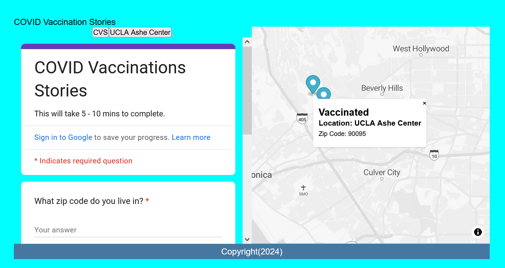

# Overview - Forms, Geocoding, Conditionals, and APIs, oh my!

Adding the data from our survey into our mapplication!

{: style="max-width:300px"}

!!! tldr "Goals"
    - Create a Google Form with meaningful questions
    - Embed a Google Form into a website using an iFrame
    - Implement a trigger for geocoding "location" data in Google Sheets
    - Understand APIs
    - Replace our `fetch` GeoJSON with data from a Google Sheet using `papa parse`
    - Use an `if` statement with a `for` loop to add data to our map

## Lab outline

1. [Creating a Google Form](./1.md)
2. [Geocoding with Google Sheets](./2.md)
3. [Connecting to our Google Sheet with `papa parse`](./3.md)
4. [Mapping data with `if-else` conditionals](./4.md)

Start by creating a `week4` folder in your lab assignments repo.

!!! done "Get ahead start"
    You can also copy the contents of your Lab Assignment's `week3` folder and skip the following setup section.

## Starting template code for lab #4

```html title="index.html" linenums="1"
<!DOCTYPE html>
<html>
    <head>
        <title>Hello World with MapLibreGl</title>
        <meta charset="utf-8" />
        <link rel="shortcut icon" href="#">
        <link rel="stylesheet" href="styles/style.css">

        <!-- MapLibreGL's css-->
        <link rel="stylesheet" href="https://unpkg.com/maplibre-gl/dist/maplibre-gl.css" />

		<!-- MapLibreGL's JavaScript-->
		<script src="https://unpkg.com/maplibre-gl/dist/maplibre-gl.js"></script>
    </head>
    
    <body>
        <header>
			COVID Vaccination Stories
        </header>
        
        <main>
			<div class="portfolio">
				<div id="contents"></div>
			</div>
            <div id="map"></div>
        </main>
        <div id="footer">
            Copyright(2024)
        </div>
        <script src="js/init.js"></script>
    </body>
</html>
```

```css title="styles/style.css"
* {
	font-family: Arial, sans-serif;
	margin: 0;
	padding: 0;
	box-sizing: border-box;
}

html {
	background-color: aqua;
}

html, body {
	height: 80vh;
	padding: 1rem;
	box-sizing: border-box;
}

body {
	display: grid;
	grid-template-areas: 
		"header" 
		"main"  
		"footer"; 
	grid-template-rows: auto 1fr auto;
}

main {
	display: grid;
	grid-template-areas:
		"portfolio map";
	grid-template-columns: 1fr 1fr;
	grid-area: main;
}

header { 
	grid-area: header;
}

.portfolio {
	grid-area: portfolio;
	display: flex;
	flex-direction: column;
	justify-content: center;
	align-items: center;
}

#map { 
	grid-area: map;
	height: 80vh;
}

#footer {
	grid-area: footer;
	padding: 5px;
	background-color: #4677a0;
	color: #fff;
	text-align: center;
}

#contents{
	display: flex;
	justify-content: center;
	align-items: center;
	gap: 10px;
}
```

```js title="js/init.js" linenums="1"
// declare variables
let mapOptions = {'centerLngLat': [-118.444,34.0709],'startingZoomLevel':5}

const map = new maplibregl.Map({
	container: 'map',
	style: 'https://api.maptiler.com/maps/streets-v2-light/style.json?key=wsyYBQjqRwKnNsZrtci1',
	center: mapOptions.centerLngLat,
	zoom: mapOptions.startingZoomLevel
});

function addMarker(lat,lng,title,message){
	let popup_message = `<h2>${title}</h2> <h3>${message}</h3>`
	new maplibregl.Marker()
		.setLngLat([lng, lat])
		.setPopup(new maplibregl.Popup()
			.setHTML(popup_message))
		.addTo(map)
	createButtons(lat,lng,title);
	return message
}

function createButtons(lat,lng,title){
    const newButton = document.createElement("button");
    newButton.id = "button"+title;
    newButton.innerHTML = title;
    newButton.setAttribute("lat",lat);
    newButton.setAttribute("lng",lng);
    newButton.addEventListener('click', function(){
        map.flyTo({
			center: [lng,lat],
		})
    })
    document.getElementById("contents").appendChild(newButton);
}

map.on('load', function() {
    fetch("map.geojson")
        .then(response => response.json())
        .then(data => {
            processData(data);
        });
});

function processData(results){
	//console.log(results) //for debugging: this can help us see if the results are what we want
	results.features.forEach(feature => {
		//console.log(feature) // for debugging: are we seeing each feature correctly?
		// assumes your geojson has a "title" and "message" attribute
		let coordinates = feature.geometry.coordinates;
		let longitude = coordinates[0];
		let latitude = coordinates[1];
		let title = feature.properties.title;
		let message = feature.properties.message;
		addMarker(latitude,longitude,title,message);
	});
};
```