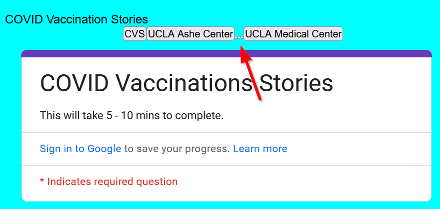

# Final Touch ups

The goal of this lab is to clean up our code and make it more readable. We will be removing unused variables and making our code more user-friendly. This will make it easier for us to debug and maintain our code in the future.

## Using variables to make our code more readable

In our `init.js` file's `addMarker()` function, we have a lot of variables that are not used from the last lab's final template.

We will clean up the following functions:

- `processData()`
- `addMarker()`
- `createButtons()`

In that order!

## Refactor `processData()`

In the `processData()` function, we have the following variables that are not used:

```js title="js/init.js" linenums="1-4"
function processData(results){
	results.forEach(feature => {
		let longitude = feature['lng']
		let latitude = feature['lat'];
		let title = feature['Where did you get vaccinated?'];
		let message = feature['What zip code do you live in?'];
		addMarker(feature);
	});
};
```

Let's clean up our code by removing these unused variables.

```js title="js/init.js" linenums="1-4"
function processData(results){
	results.forEach(feature => {
		addMarker(feature);
	});
};
```

## Refactor `addMarker()`

In the `addMarker()` function, there are some unused variables, but more importantly we can make new variables using the survey data in mind to make our code more readable.

===before
	```js title="js/init.js" linenums="1-12"
	function addMarker(data){
		let popup_message;
		let lng = data['lng'];
		let lat = data['lat'];
		if (data['Have you been vaccinated?'] == "Yes"){
			popup_message = `<h2>Vaccinated</h2> <h3>Location: ${data['Where did you get vaccinated?']}</h3> <p>Zip Code: ${data['What zip code do you live in?']}</p>`
		}
		else{
			popup_message = `<h2>Not Vaccinated</h2><p>Zip Code: ${data['What zip code do you live in?']}</p>`
		}
		new maplibregl.Marker()
			.setLngLat([lng, lat])
			.setPopup(new maplibregl.Popup()
				.setHTML(popup_message))
			.addTo(map)
		createButtons(lat,lng,data['Where did you get vaccinated?']);
	}
	```

===after
	```js title="js/init.js" linenums="1-12"
	function addMarker(data){
		let longitude = data['lng']
		let latitude = data['lat'];
		let vaccinationLocation = data['Where did you get vaccinated?'];
		let homeZipcode = data['What zip code do you live in?'];
		let popup_message;
		if (data['Have you been vaccinated?'] == "Yes"){
			popup_message = `<h2>Vaccinated</h2> <h3>Location: ${vaccinationLocation}</h3> <p>Zip Code: ${homeZipcode}</p>`
		}
		else{
			popup_message = `<h2>Not Vaccinated</h2><p>Zip Code: ${homeZipcode}</p>`
		}
		new maplibregl.Marker()
			.setLngLat([longitude, latitude])
			.setPopup(new maplibregl.Popup()
				.setHTML(popup_message))
			.addTo(map)
		createButtons(latitude,longitude,vaccinationLocation);
	}
	```

Feel free to choose your own variable names, but make sure they are descriptive and make your code more readable. Most importantly, keep a consistent naming convention!

### Refactor `createButtons()`

In the `createButtons()` function, buttons are being created even when the user is not vaccinated. As indicated by this tiny little button:



We can clean up our code by only creating buttons for users who are vaccinated.

===before
	```js title="js/init.js" linenums="1-15"
	function createButtons(lat,lng,title){
	    const newButton = document.createElement("button");
	    newButton.id = "button"+title; 
	    newButton.innerHTML = title;
	    newButton.setAttribute("lat",lat);
	    newButton.setAttribute("lng",lng);
	    newButton.addEventListener('click', function(){
	        map.flyTo({
				center: [lng,lat],
			})
	    })
	    document.getElementById("contents").appendChild(newButton);
	}
	```

===after
	```js title="js/init.js" linenums="1-15"
	function createButtons(lat,lng,title){
		if (!title){
			return;
		}
		
		const newButton = document.createElement("button");
		newButton.id = "button"+title; 
		newButton.innerHTML = title;
		newButton.setAttribute("lat",lat);
		newButton.setAttribute("lng",lng);
		newButton.addEventListener('click', function(){
			map.flyTo({
				center: [lng,lat],
			})
		})
		document.getElementById("contents").appendChild(newButton);
	}
	```

What we did was we just told the function to return if the title is empty. This way, we only create buttons for users who are vaccinated.

## Refactor the Survey Button

Speaking of buttons, we should probably move our survey iframe into a button as well. This will make our UI cleaner and more readable.

```html title="index.html" linenums="1-8"
	<header>
		COVID Vaccination Stories
		<a href="https://docs.google.com/forms/d/e/1FAIpQLSfcElv5dlXInR7XHQz27_OcYJlWcIUr-GBbc-ocefWlGd1uXg/viewform?embedded=true" target="_blank">
			<button id="surveyButton">Take the Survey</button>
		</a>
	</header>
     <!-- truncated for brevity -->

	<main>
		<div class="portfolio">
			<div id="contents">
			</div>
				<!-- deleted iframe for survey -->
		</div>
		<div id="map"></div>
	</main>
```

## Conclusion

We have cleaned up our code to make it more readable and user-friendly. This will make it easier for us to debug and maintain our code in the future. Remember, the most important thing is to keep your code clean and readable so that others and yourself can understand it easily.

Now that we have cleaned up our code, we can move on to adding more features to our map!

## Checkpoint

```init.js``` should look like this:

```js title="js/init.js" linenums="1-12"

let mapOptions = {'centerLngLat': [-118.444,34.0709],'startingZoomLevel':5}

const map = new maplibregl.Map({
    container: 'map',
    style: 'https://api.maptiler.com/maps/streets-v2-light/style.json?key=wsyYBQjqRwKnNsZrtci1',
    center: mapOptions.centerLngLat,
    zoom: mapOptions.startingZoomLevel
});

function addMarker(data){
	let longitude = data['lng']
	let latitude = data['lat'];
	let vaccinationLocation = data['Where did you get vaccinated?'];
	let homeZipcode = data['What zip code do you live in?'];
	let vaccinationStatus = data['Have you been vaccinated?']
    let popup_message;
    if (data['Have you been vaccinated?'] == "Yes"){
        popup_message = `<h2>Vaccinated</h2> <h3>Location: ${vaccinationLocation}</h3> <p>Zip Code: ${homeZipcode}</p>`
    }
    else{
        popup_message = `<h2>Not Vaccinated</h2><p>Zip Code: ${homeZipcode}</p>`
    }
    new maplibregl.Marker()
        .setLngLat([longitude, latitude])
        .setPopup(new maplibregl.Popup()
            .setHTML(popup_message))
        .addTo(map)
    createButtons(latitude,longitude,vaccinationLocation);
}

function createButtons(lat,lng,title){
	if (!title){
		return;
	}
    const newButton = document.createElement("button");
    newButton.id = "button"+title; 
    newButton.innerHTML = title;
    newButton.setAttribute("lat",lat);
    newButton.setAttribute("lng",lng);
    newButton.addEventListener('click', function(){
        map.flyTo({
            center: [lng,lat],
        })
    })
    document.getElementById("contents").appendChild(newButton);
}

const dataUrl = "https://docs.google.com/spreadsheets/d/e/2PACX-1vSNq8_prhrSwK3CnY2pPptqMyGvc23Ckc5MCuGMMKljW-dDy6yq6j7XAT4m6GG69CISbD6kfBF0-ypS/pub?output=csv"

map.on('load', function() {

    Papa.parse(dataUrl, {
        download: true,
        header: true,
        complete: function(results) {
        
            processData(results.data);
        }
    });
});

function processData(results){
    results.forEach(feature => {
        addMarker(feature);
    });
};

// Assuming your categories are 'Vaccinated' and 'Not Vaccinated'
function createFilterUI() {
    const categories = ['Vaccinated', 'Not Vaccinated'];
    const filterGroup = document.getElementById('filter-group') || document.createElement('div');
    filterGroup.setAttribute('id', 'filter-group');
    filterGroup.className = 'filter-group';
    document.body.appendChild(filterGroup);

    categories.forEach(category => {
        const input = document.createElement('input');
        input.type = 'checkbox';
        input.id = category;
        input.checked = true;
        filterGroup.appendChild(input);

        const label = document.createElement('label');
        label.setAttribute('for', category);
        label.textContent = category;
        filterGroup.appendChild(label);

        input.addEventListener('change', function(e) {
            const markers = document.querySelectorAll(`.marker-${category}`);
            markers.forEach(marker => {
                marker.style.display = e.target.checked ? '' : 'none';
            });
        });
    });
}
```

```html title="index.html" linenums="1-8"
<!DOCTYPE html>
<html>
    <head>
        <title>Hello World with MapLibreGl</title>
        <!-- hint: remember to change your page title! -->
        <meta charset="utf-8" />
        <link rel="shortcut icon" href="#">
        <link rel="stylesheet" href="styles/style.css">

        <!-- MapLibreGL's css-->
        <link rel="stylesheet" href="https://unpkg.com/maplibre-gl/dist/maplibre-gl.css" />

        <!-- MapLibreGL's JavaScript-->
        <script src="https://unpkg.com/maplibre-gl/dist/maplibre-gl.js"></script>
        <script src="https://cdnjs.cloudflare.com/ajax/libs/PapaParse/5.3.0/papaparse.min.js"></script>
    </head>

    <body>
        <header>
            COVID Vaccination Stories
			<a href="https://docs.google.com/forms/d/e/1FAIpQLSfcElv5dlXInR7XHQz27_OcYJlWcIUr-GBbc-ocefWlGd1uXg/viewform?embedded=true" target="_blank">
				<button id="surveyButton">Take the Survey</button>
			</a>
		</header>

        <main>
            <div class="portfolio">
                <div id="contents">
                </div>

			</div>
            <div id="map"></div>
        </main>
        <div id="footer">
            Copyright(2024)
        </div>
        <script src="js/init.js"></script>
    </body>
</html>
```

