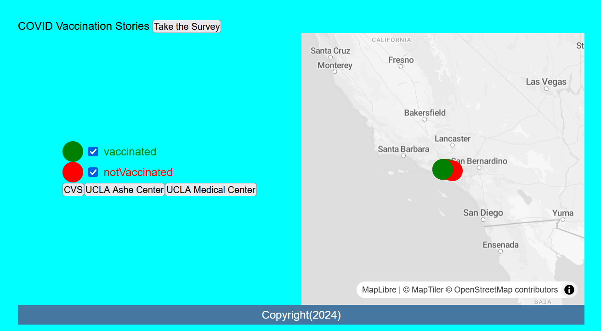

# Overview - Final Finishing Touches

Today's lab we will focus on touching our mapplication, and then use MapLibreGL [`Feature groups`](https://leafletjs.com/reference.html#featuregroup) to style our map content.

`Feature groups` are like containers that you can use to group your map content. For this lab we will be creating two layers for our survey question of `"Have you been vaccinated?"`

One group will be for `yes` and another group for `no`.

{: style="max-width:300px"}

!!! tldr "Goals"
    - Refactor our map code to clean up messy UI elements
    - Use conditional statements to add content into MapLibreGL `FeatureGroups`
    - Use CSS to style our markers

## Lab outline

1. [Final Touch ups](./1.md)
2. [Adding categories in our `addMarker()` function](./2.md)

Start by creating a `week5` folder in your lab assignments repo.

## Starting template code for lab #5

```html title="index.html" linenums="1"
<!DOCTYPE html>
<html>
    <head>
        <title>Hello World with MapLibreGl</title>
        <!-- hint: remember to change your page title! -->
        <meta charset="utf-8" />
        <link rel="shortcut icon" href="#">
        <link rel="stylesheet" href="styles/style.css">

        <!-- MapLibreGL's css-->
        <link rel="stylesheet" href="https://unpkg.com/maplibre-gl/dist/maplibre-gl.css" />

		<!-- MapLibreGL's JavaScript-->
		<script src="https://unpkg.com/maplibre-gl/dist/maplibre-gl.js"></script>
		<script src="https://cdnjs.cloudflare.com/ajax/libs/PapaParse/5.3.0/papaparse.min.js"></script>
    </head>
    
    <body>
        <header>
			COVID Vaccination Stories
        </header>
        
        <main>
			<div class="portfolio">
				<div id="contents">
				</div>
				<iframe src="https://docs.google.com/forms/d/e/1FAIpQLSfcElv5dlXInR7XHQz27_OcYJlWcIUr-GBbc-ocefWlGd1uXg/viewform?embedded=true" width="100%" height="100%" frameborder="0" marginheight="0" marginwidth="0">Loading…</iframe>
			</div>
            <div id="map"></div>
        </main>
        <div id="footer">
            Copyright(2024)
        </div>
        <script src="js/init.js"></script>
    </body>
</html>
```

```js title="js/init.js" linenums="1"

let mapOptions = {'centerLngLat': [-118.444,34.0709],'startingZoomLevel':5}

const map = new maplibregl.Map({
	container: 'map', 
	style: 'https://api.maptiler.com/maps/streets-v2-light/style.json?key=wsyYBQjqRwKnNsZrtci1', 
	center: mapOptions.centerLngLat, [lng, lat]
	zoom: mapOptions.startingZoomLevel level
});

function addMarker(data){
	let popup_message;
	let lng = data['lng'];
	let lat = data['lat'];
	if (data['Have you been vaccinated?'] == "Yes"){
		popup_message = `<h2>Vaccinated</h2> <h3>Location: ${data['Where did you get vaccinated?']}</h3> <p>Zip Code: ${data['What zip code do you live in?']}</p>`
	}
	else{
		popup_message = `<h2>Not Vaccinated</h2><p>Zip Code: ${data['What zip code do you live in?']}</p>`
	}
	new maplibregl.Marker()
		.setLngLat([lng, lat])
		.setPopup(new maplibregl.Popup()
			.setHTML(popup_message))
		.addTo(map)
	createButtons(lat,lng,data['Where did you get vaccinated?']);
}

function createButtons(lat,lng,title){
    const newButton = document.createElement("button");
    newButton.id = "button"+title; 
    newButton.innerHTML = title;
    newButton.setAttribute("lat",lat);
    newButton.setAttribute("lng",lng);
    newButton.addEventListener('click', function(){
        map.flyTo({
			center: [lng,lat],
		})
    })
    document.getElementById("contents").appendChild(newButton);
}

const dataUrl = "https://docs.google.com/spreadsheets/d/e/2PACX-1vSNq8_prhrSwK3CnY2pPptqMyGvc23Ckc5MCuGMMKljW-dDy6yq6j7XAT4m6GG69CISbD6kfBF0-ypS/pub?output=csv"


map.on('load', function() {
    a Google Forms spreadsheet URL
    Papa.parse(dataUrl, {
        download: true, CSV data from the URL
        header: true, are column headers
        complete: function(results) {
            
            processData(results.data); function to handle CSV data
        }
    });
});

function processData(results){
	results.forEach(feature => {
		"message" attribute
		let longitude = feature['lng']
		let latitude = feature['lat'];
		let title = feature['Where did you get vaccinated?'];
		let message = feature['What zip code do you live in?'];
		addMarker(feature);
	});
};
```

```css title="styles/style.css" linenums="1"

* {
	font-family: Arial, sans-serif;
	margin: 0; 
	padding: 0; 
	box-sizing: border-box;
}

html {
	background-color: aqua;
}


html, body {
	height: 80vh;
	padding: 1rem;
	box-sizing: border-box;
}


body {
	display: grid; 
	grid-template-areas: 
		"header" 
		"main"   
		"footer"; 
	grid-template-rows: auto 1fr auto;
}

main {
	display: grid;
	grid-template-areas:
		"portfolio map";
	grid-template-columns: 1fr 1fr;
}

header { 
	grid-area: header;
}

main { 
	grid-area: main;
}

.portfolio {
	grid-area: portfolio;
	display: flex;
	flex-direction: column;
	justify-content: center;
	align-items: center;
}


#map { 
	grid-area: map;
	height: 80vh;
}

#footer {
	grid-area: footer;
	padding: 5px; 
	background-color: #4677a0;
	color: #fff;
	text-align: center; 
}
```
