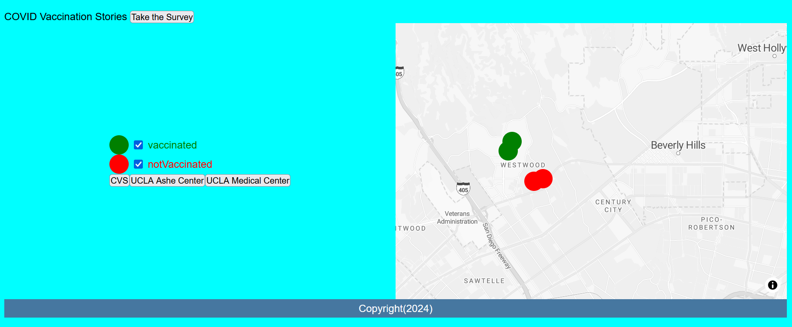
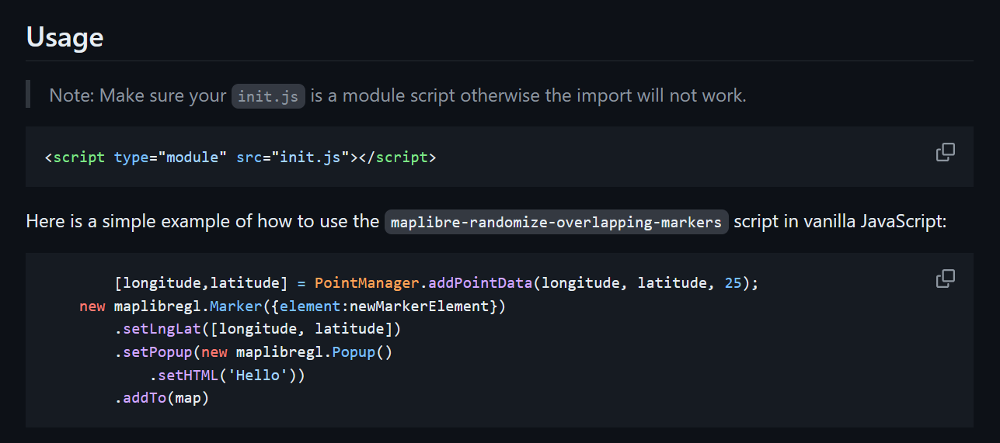

# Adding a new MapLibreGL JavaScript Plugin

Plugins are a great way to add extra functionality to your MapLibreGL map.

Here are some examples:

## Visualizations
- [Turf.js](https://turfjs.org/)
- [Charts](https://www.chartjs.org/docs/latest/samples/bar/vertical.html)

## General JavaScript Functions
- [Scrollama](https://russellsamora.github.io/scrollama/sticky-side/)

## MapLibreGL Related

- https://maplibre.org/maplibre-gl-js/docs/plugins/

To keep things simple, we will add a cluster marker functionality to our MapLibreGL map. Clustering makes it easier to see when multiple points are in the same area.

With just a few changes our map will look as follows:


As with when we first used MapLibreGL we need to include the library, so in our html add the following lines:

```html title="index.html"
        <!-- Overlapping Markers JavaScript -->
		<script src="https://unpkg.com/maplibre-randomize-overlapping-markers/dist/bundle.js"></script>
```	

Next, let's read the documentation on how to use the `cluster maker`:



Judging from this code, we need to turn our `init.js` into a module.

```html
<script type="module" src="js/init.js"></script>
```

Next we need to add the following code to our `init.js`:

```js title="js/init.js"
	const [modifiedLongitude, modifiedLatitude] = PointManager.addPointData(longitude, latitude, 25);

	const marker = new maplibregl.Marker()
		.setLngLat([modifiedLongitude, modifiedLatitude])
		.addTo(map);
```

And... wow that's it!

This flexibility is what makes opensource tools and plugins so great! However, be warned that not all plugins will be as simple to plug and play.

Congrats!

After you've made this change the time has come to make a pull request!