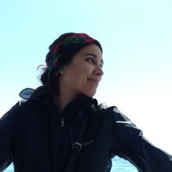

# Week 2 - Humanizing Technology

Date|Type|Description|Slides|Recording|
|---|----|-----------|------|---------|
|7/1|Critical Cartography and Civil Society|Lecture|TBD|TBD
|7/1|[JavaSCrypt of the Necrodancer]|Lab|TBD|TBD

## Lecture

- Critical Cartography and Civil Society
 
### Visiting Voice: Mariah Tso (7/3)

Mariah Tso is a Diné woman, artist, and GIS Specialist for the [Ralph J. Bunche Center](https://bunchecenter.ucla.edu/) and the [Million Dollar Hoods Project](https://milliondollarhoods.pre.ss.ucla.edu/).

- [Discussion #1 - Document](https://docs.google.com/document/d/1kFfSY3FOYjmkDQwF0iWhwwaa4aODrNtHL1MXd_gLFwY/copy)
- [Discussion #1 - Submission](https://docs.google.com/spreadsheets/d/1ZAr9Hd9fmtevEGRadA_a4xl-AoXM8eZJ3VQFygXnT5o/edit#gid=1823767792)

## Lab

- [MapLibRevisiting your portfolios](../labs/week2/lab1more.md)
- JavaScript Returns: An Action-Packed, FUNction-Filled Adventure

## Assignments

### Due Monday 7/1

- [**Thinking Cap: What are problems with the way we use data and GIS?**](../assignments/week1/thinking_cap.md)
- [**Finish the weekly reading**](../assignments/week1/reading.md) [[PDF]](../materials/readings/An_Introduction_to_Critical_Cartography.pdf)
 
### Due Wednesday 7/3

- [**Lab #1: Portfolio**](../assignments/week1/lab_assignment.md)
- [**Group Assignment #1: Repository and Readme**](../assignments/week1/group_assignment.md)
- [Pre-lab](../assignments/week2/prelab.md)

### Due Monday 7/8

- [**Whose map? Who is empowered and who is disempowered?**](../assignments/week2/reading.md)
- [Thinking Cap #2](https://github.com/albertkun/24SU-ASIAAM-191A/discussions/10)

### Due Wednesday 7/10

- [Lab Assignment #2](../assignments/week2/lab_assignment.md)
- [Optional: Pre-lab](../assignments/week3/prelab.md)
- [Group Assignment #2](../assignments/week2/group_assignment.md)
