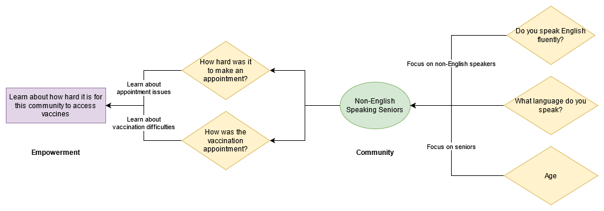

## Survey Diagram
Generate a diagram that explains how your survey questions and objectives in the memo are connected to goal of empowering the community. 

Your diagram must have these components:
   1. Represent the specific community are you trying to uplift.
   2. Represent the survey/project goal.
   3. Represent each question in your survey and draw lines connecting them to either the community representation or the survey/project goal. 
   4. As you draw the lines from each question, explain what connection is being made.

Feel free to get creative, but be sure to emphasis how your questions are related to the objective of the survey.

### Tools
- [DrawIO](http://draw.io/)
- [Canva](https://www.canva.com/)
- [Powerpoint/Google Slides](https://www.google.com/slides/about/)

See below for an example using [Draw.io](https://draw.io):

https://drive.google.com/file/d/12UbBhuXm28RAhgFo5nLiVZ9cmtzNecwi/view?usp=sharing